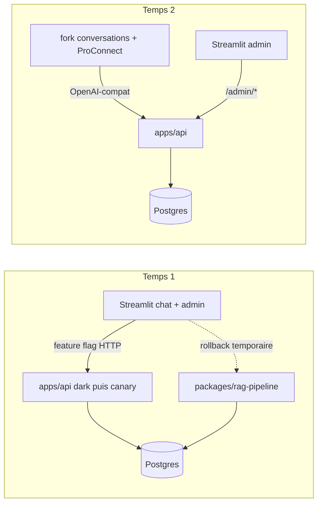

# Chantier hexagonal-split — Vue d'ensemble

> Statut : plan amendé (grilling du 2026-08-21, revue d'architecture et clarification du 2026-08-25, sur la base du grilling du 2026-07-03).
> Portée : transformation du monolithe en architecture front & back hexagonale, contrat public OpenAI-compatible.
> Documents du dossier : [architecture cible](01-target-architecture.md) · [contrat API](02-api-contract.md) · [diagrammes de séquence](03-sequence-diagrams.md) · [plan de migration](04-migration-plan.md) · [environnements](05-environments.md) · [LEDGER](LEDGER.md)

## Problème

Le repo est un monolithe Streamlit : `packages/rag-pipeline` mélange métier et accès DB dans les mêmes fichiers (`pipeline.py`, `chat_logger.py`, `admin.py`), `src/ui` porte 6 000 lignes de logique couplée à Streamlit, et le seul chemin d'accès au RAG est l'import Python direct depuis `01_Chatbot.py`. Aucun consommateur externe ne peut se brancher, et le futur front (La Suite `conversations`) parle OpenAI, pas Python.

## Solution en deux temps

**Temps 1 (ce chantier)** — construire en parallèle un core hexagonal dans `packages/rag-core` et un backend `apps/api` exposant un contrat OpenAI-compatible, sans modifier le chemin de production existant pendant la reconstruction ; déployer l'API à côté de Streamlit ; basculer ensuite `01_Chatbot.py` et les pages admin derrière des feature flags ; supprimer l'ancien chemin direct seulement après une période de stabilité prouvée.

**Temps 2 (chantier ultérieur)** — un fork de [suitenumerique/conversations](https://github.com/suitenumerique/conversations) (adapté à nos besoins, dont le feedback) remplace le chat Streamlit ; Streamlit devient une pure interface d'admin ; ProConnect vit dans le front, jamais dans l'API RAG.

## Décisions actées (avec leurs pourquoi)

| # | Décision | Pourquoi |
|---|---|---|
| D1 | **Contrat public = OpenAI-compat** (`/v1/chat/completions`, `/v1/models`), pas MCP | Le consommateur v1 est un front de chat (`conversations`) qui ne parle que ça ; un MCP retrieval céderait la génération au client et invaliderait toute la boucle qualité (évals goldset, satisfaction 3,73). Un adaptateur MCP reste possible en v2 grâce à l'hexagone. |
| D2 | **Routage ministère par le nom de modèle** : un « modèle » par ministère autorisé (`assistant-rh-matte`, …), `/v1/models` filtré par le token, fallback `default_ministry` | 100 % dans le contrat OpenAI ; `conversations` affiche nativement un sélecteur de modèle ; aucun header custom fragile. |
| D3 | **Reconstruction parallèle** : le domaine pur vit dans `packages/rag-core` ; `apps/api` porte les handlers, le wiring et les adaptateurs DB/provider. `packages/rag-pipeline` reste le chemin de production jusqu'à la fin de la bascule, puis disparaît | Le core est une bibliothèque consommable par l'API et le runner d'éval, jamais l'inverse. Le parallèle permet une comparaison déterministe et un rollback sans faire dépendre Streamlit d'une arborescence en cours de découpe. |
| D4 | **Le core garde l'orchestration du retrieval** (fusion, gates, sélection) ; `db` ne porte que l'accès données derrière des ports étroits | C'est la logique que les campagnes qualité optimisent — elle doit rester dans le domaine, visible et testable sans infra. |
| D5 | **À l'état cible, Streamlit ne touche plus Postgres** : chat client HTTP, admin cliente `/admin/*` | La frontière est atteinte après la période de double chemin. Pendant la bascule, l'ancien chemin DB reste disponible uniquement comme rollback. `15_Import_Sources` parle Grist + S3 (domaine ingestion séparé). |
| D6 | **Auth** : bearer par groupe (nouvelle colonne `user_groups.api_token_hash`, PBKDF2) pour le public ; `ADMIN_TOKEN` statique en env pour `/admin/*` (v1) | Minimal ; rotation admin = redeploy. Dette assumée : tokens admin en DB avec rôle à l'arrivée de ProConnect. |
| D7 | **PRs additives vers `dev`** : le nouveau package et l'API atterrissent par petites PRs sans devenir consommateurs de production ; l'ancien runtime reste inchangé jusqu'à la bascule | Le code parallèle peut suivre le flux CI et de promotion habituel, être déployé « dark » et éviter une grosse branche durable. Chaque PR reste reviewable et réversible. |
| D8 | **Parité suivie au LEDGER** : tout changement comportemental du pipeline existant est reporté dans le nouveau core et noté au [LEDGER](LEDGER.md) ; court gel avant M3 | Le LEDGER reste le point de vérité de la dérive entre les deux implémentations qui cohabitent temporairement sur `dev`. |
| D9 | **Deux niveaux de preuve** : conformance déterministe (ports fake/replay, sorties d'étapes et enveloppes API exactes) ; éval goldset live (qualité appariée avec tolérances) | L'égalité exacte n'est valable que sur des dépendances figées. Les appels LLM live sont non déterministes et servent à prouver la non-régression qualité, pas l'identité octet par octet. |
| D10 | **Environnements** : dev quotidien full local avec schéma runtime synthétique ; spike `conversations` + SSE Scaleway dès la phase 0 ; parité sur VM homelab ; API déployée « dark » à côté de Streamlit avant toute bascule | Les inconnues de compatibilité client et de streaming serverless sont levées tôt. Le déploiement parallèle permet un canary et un rollback du consommateur. |
| D11 | **Feedback** : `POST /v1/feedback`, l'id de completion = le `turn_id` du `chat_run` | La métrique produit centrale survit à la séparation sans état serveur supplémentaire. Au temps 2, le fork `conversations` appellera cet endpoint. |
| D12 | **mastra-pipeline supprimé en PR 1** | Confirmé comme code mort, sans consommateur ni déploiement ; sa suppression est indépendante de la bascule du pipeline Python. |
| D13 | **État par requête explicite** : aucun `last_*` mutable partagé entre requêtes ; ressources partagées limitées aux pools, clients HTTP et caches thread-safe | FastAPI introduit de la concurrence que le chemin Streamlit actuel n'exerce pas. L'isolation de requête protège résultats, traces et données de ministère. |
| D14 | **Bascule réversible** : API dark → Streamlit sous feature flag → canary/stabilité → suppression de l'ancien chemin | Le déploiement de l'API et le retrait de `packages/rag-pipeline` ne sont jamais dans la même étape opérationnelle. |

## Inventaire de fin de chantier

**À supprimer dès A1 car mort** : `apps/mastra-pipeline` (+ scripts de conformance strictement Mastra).

**À supprimer seulement après stabilité de la bascule** : `packages/rag-pipeline` · les modules `src/ui/chatbot_*` du chemin direct-import · l'accès DB direct de Streamlit · les flags de rollback.

**Créé** : `packages/rag-core/` (domaine + ports) · `apps/api/` (handlers, wiring, db, gateways) · `Dockerfile.api` · runners de conformance déterministe et d'éval via-API · garde CI de frontière d'imports · migration d'auth API · fixtures runtime locales sans données personnelles.

**Conservé / adapté** : `apps/streamlit-ui` (ancien chemin conservé pendant le canary, puis chat/admin clients HTTP ; `15_Import_Sources` inchangé) · `src/goldset` + skill `run-rag-eval` repointés sur `packages/rag-core` avec adaptateurs explicites · `packages/data-engineering` + `apps/data-ingestion-cli` intouchés · `packages/shared-config` conservé.

## Risques principaux

1. **Inventaire d'I/O incomplet** (SQL, prompts, acronymes, caches, provider, état mutable au-delà de `retriever.py`) → audit B0 systématique avant les découpes ; chaque dépendance devient un port ou une donnée de requête.
2. **Régression qualité silencieuse pendant la reconstruction parallèle** → conformance déterministe à chaque PR, pytest vert, évals live aux jalons (voir [plan de migration](04-migration-plan.md)).
3. **Dérive entre ancien et nouveau core** → reports notés au LEDGER, gel final court, aucune amélioration opportuniste dans le portage.
4. **Timeouts / comportement SSE sur Scaleway serverless ou incompatibilité `conversations`** → spikes en phase 0, puis smoke du vrai container avant bascule.
5. **Bascule API + Streamlit couplée** → API dark et observable d'abord ; feature flag et ancien chemin conservé pendant la fenêtre de stabilité.
6. **Perte de fonctions admin/feedback** → matrice de parité page par page ; aucune page fonctionnelle n'est archivée sans décision produit explicite.

## Points ouverts

- Validation DINUM/DGAFP du mode de déploiement du fork `conversations` et de l'auth fork → API ; le spike technique est bloquant en phase 0, la décision organisationnelle peut suivre.
- Sort définitif des pages DB/éval/debug : réintégration via API, maintien temporaire ou archivage approuvé (matrice en phase A).
