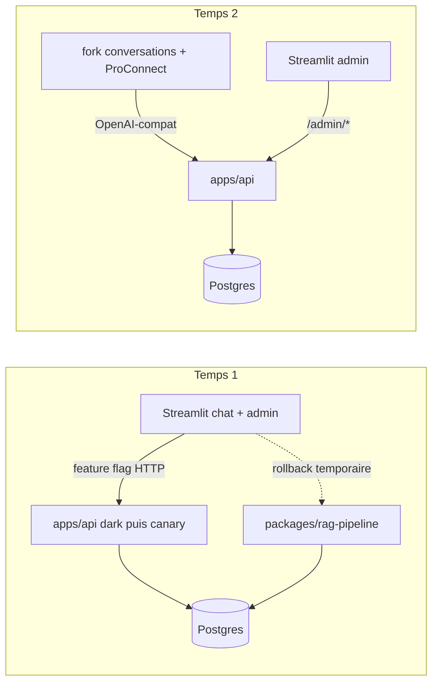

# Chantier hexagonal-split — Vue d'ensemble

> Statut : plan amendé (grilling du 2026-08-21, revue d'architecture et clarification du 2026-08-25, sur la base du grilling du 2026-07-03).
> Portée : transformation du monolithe en architecture front & back hexagonale, contrat public OpenAI-compatible.
> Documents du dossier : [décisions](06-decisions.md) · [architecture cible](01-target-architecture.md) · [contrat API](02-api-contract.md) · [diagrammes de séquence](03-sequence-diagrams.md) · [plan de migration](04-migration-plan.md) · [environnements](05-environments.md) · [LEDGER](LEDGER.md)

## Problème

Le repo est un monolithe Streamlit : `packages/rag-pipeline` mélange métier et accès DB dans les mêmes fichiers (`pipeline.py`, `chat_logger.py`, `admin.py`), `src/ui` porte 6 000 lignes de logique couplée à Streamlit, et le seul chemin d'accès au RAG est l'import Python direct depuis `01_Chatbot.py`. Aucun consommateur externe ne peut se brancher, et le futur front (La Suite `conversations`) parle OpenAI, pas Python.

## Solution en deux temps

**Temps 1 (ce chantier)** — construire en parallèle un backend `apps/api` hexagonal exposant un contrat OpenAI-compatible, sans modifier le chemin de production existant pendant la reconstruction. Dans l'API, les adaptateurs DB/provider sont construits d'abord, puis la logique est extraite du package historique étape par étape vers `assistant_rh_api/core` sans déplacer les fonctions couplées telles quelles. L'API est ensuite déployée à côté de Streamlit ; `01_Chatbot.py` et les pages admin basculent derrière des feature flags ; l'ancien chemin direct n'est supprimé qu'après une période de stabilité prouvée.

**Temps 2 (chantier ultérieur)** — un fork de [suitenumerique/conversations](https://github.com/suitenumerique/conversations) (adapté à nos besoins, dont le feedback) remplace le chat Streamlit ; Streamlit devient une pure interface d'admin ; ProConnect vit dans le front, jamais dans l'API RAG.

## Décisions actées

Les décisions et leur justification sont regroupées par catégorie dans [06-decisions.md](06-decisions.md) :

- architecture et contrat : D1 à D6 ;
- migration et livraison : D7 à D10, D12 et D14 ;
- exécution et données produit : D11 et D13.

## Inventaire de fin de chantier

**À supprimer dès A1 car mort** : `apps/mastra-pipeline` (+ scripts de conformance strictement Mastra).

**À supprimer seulement après stabilité de la bascule** : `packages/rag-pipeline` · les modules `src/ui/chatbot_*` du chemin direct-import · l'accès DB direct de Streamlit · les flags de rollback.

**Créé** : `apps/api/` (`core`, handlers, wiring, db, gateways) · `Dockerfile.api` · runners de conformance déterministe et d'éval via-API · garde CI de frontière d'imports · migration d'auth API · fixtures runtime locales sans données personnelles.

**Conservé / adapté** : `apps/streamlit-ui` (ancien chemin conservé pendant le canary, puis chat/admin clients HTTP ; `15_Import_Sources` inchangé) · `src/goldset` + skill `run-rag-eval` repointés sur `assistant_rh_api.core` avec adaptateurs explicites · `packages/data-engineering` + `apps/data-ingestion-cli` intouchés · `packages/shared-config` conservé.

## Risques principaux

1. **Inventaire d'I/O incomplet** (SQL, prompts, acronymes, caches, provider, état mutable au-delà de `retriever.py`) → audit A5 systématique avant les découpes ; chaque dépendance devient un port ou une donnée de requête.
2. **Régression qualité silencieuse pendant la reconstruction parallèle** → conformance déterministe à chaque PR, pytest vert, évals live aux jalons (voir [plan de migration](04-migration-plan.md)).
3. **Dérive entre ancien et nouveau core** → reports notés au LEDGER, gel final court, aucune amélioration opportuniste dans le portage.
4. **Timeouts / comportement SSE sur Scaleway serverless ou incompatibilité `conversations`** → contrat testé en local/homelab, puis validation de la plateforme dès le premier déploiement dark en staging.
5. **Bascule API + Streamlit couplée** → API dark et observable d'abord ; feature flag et ancien chemin conservé pendant la fenêtre de stabilité.
6. **Perte de fonctions admin/feedback** → matrice de parité page par page ; aucune page fonctionnelle n'est archivée sans décision produit explicite.

## Points ouverts

- Validation DINUM/DGAFP du mode de déploiement du fork `conversations` et de l'auth fork → API ; le spike technique est bloquant en phase 0, la décision organisationnelle peut suivre.
- Sort définitif des pages DB/éval/debug : réintégration via API, maintien temporaire ou archivage approuvé (matrice A3 en phase 0).
