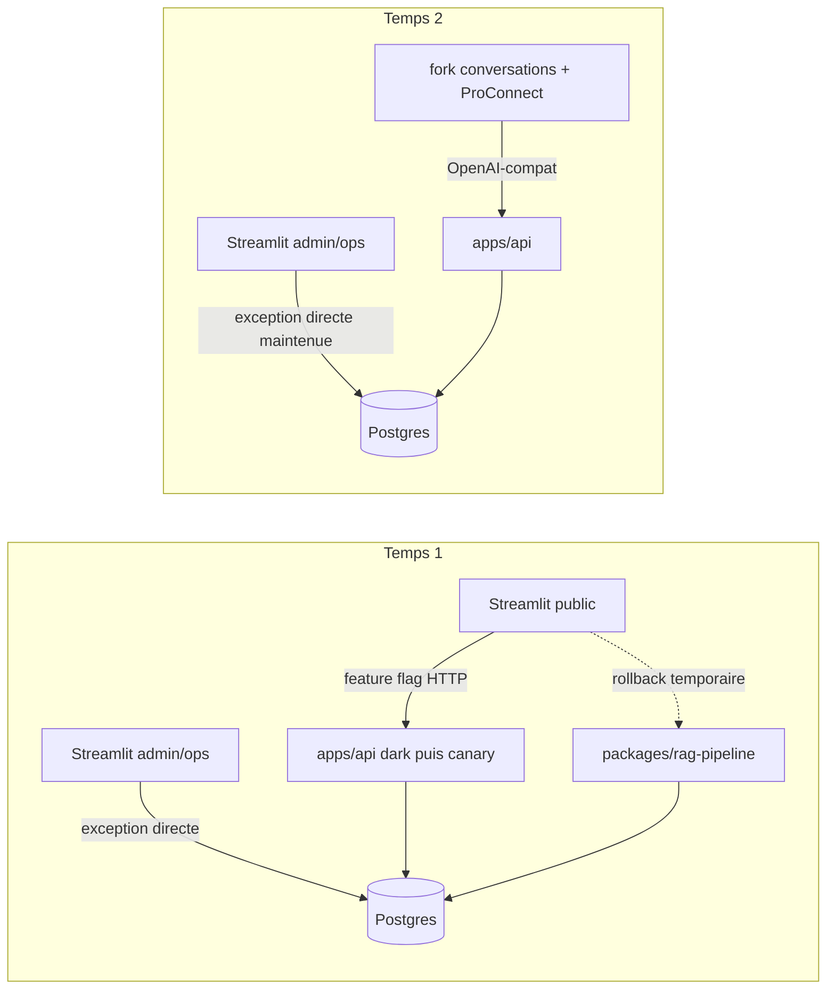

# Chantier hexagonal-split — Vue d'ensemble

> Statut : plan amendé après revue, mise à jour du 2026-09-04.
> Portée : transformation du monolithe en architecture front & back hexagonale, contrat public OpenAI-compatible.
> Documents du dossier : [décisions](06-decisions.md) · [architecture cible](01-target-architecture.md) · [contrat API](02-api-contract.md) · [diagrammes de séquence](03-sequence-diagrams.md) · [plan de migration](04-migration-plan.md) · [audit d'isolation A5](07-runtime-isolation-audit.md) · [arbitrage Streamlit A3](08-streamlit-api-parity.md) · [LEDGER](LEDGER.md)

## Problème

Le runtime actuel est couplé à Streamlit : `packages/rag-pipeline` mêle métier, SQL et appels providers, et `src/ui` porte une partie de l'orchestration. Le chat utilise des imports Python directs. Le futur front, La Suite `conversations`, a besoin d'un contrat HTTP OpenAI-compatible.

## Solution en deux temps

**Temps 1 (ce chantier)** — construire `apps/api` à côté du runtime existant : DB/adaptateurs d'abord, puis extraction progressive de la logique vers `assistant_rh_api/core`. Déployer l'API, adapter le chemin public Streamlit sous feature flag, puis retirer l'ancien chemin après stabilité. Les pages admin/ops restent dans Streamlit avec accès DB direct sous une exception gardée.

**Temps 2 (chantier ultérieur)** — un fork de [suitenumerique/conversations](https://github.com/suitenumerique/conversations) (adapté à nos besoins, dont le feedback) remplace le chat Streamlit ; Streamlit devient une pure interface d'admin ; ProConnect vit dans le front, jamais dans l'API RAG.

## Décisions actées

Voir [06-decisions.md](06-decisions.md), organisé en architecture/contrat, migration/livraison et exécution/données produit.

## Inventaire de fin de chantier

**Supprimé en A1 ([#440](https://github.com/DGAFP/assistant-rh/issues/440))** : l'ancien pipeline TypeScript, ses workflows et ses scripts de conformance dédiés.

**À supprimer seulement après stabilité de la bascule** : `packages/rag-pipeline` · les modules `src/ui/chatbot_*` du chemin direct-import · l'accès DB du chemin public Streamlit · les flags de rollback.

**Créé** : `apps/api/` (`core`, handlers, wiring, db, gateways) · `docker/api/Dockerfile` · runners de conformance déterministe et d'éval via-API · garde CI de frontière publique · migration d'auth API · fixtures runtime locales sans données personnelles.

**Conservé / adapté** : `apps/streamlit-ui` (ancien chemin public conservé pendant le canary puis client HTTP ; admin/ops avec DB directe allowlistée ; `15_Import_Sources` inchangé) · `src/goldset` + skill `run-rag-eval` repointés sur `assistant_rh_api.core` avec adaptateurs explicites · `packages/data-engineering` + `apps/data-ingestion-cli` intouchés · `packages/shared-config` conservé.

## Risques principaux

1. **Inventaire d'I/O incomplet** (SQL, prompts, acronymes, caches, provider, état mutable au-delà de `retriever.py`) → audit A5 systématique avant les découpes ; chaque dépendance devient un port ou une donnée de requête.
2. **Régression qualité silencieuse pendant la reconstruction parallèle** → conformance déterministe à chaque PR, pytest vert, évals live aux jalons (voir [plan de migration](04-migration-plan.md)).
3. **Dérive entre ancien et nouveau core** → reports notés au LEDGER, gel final court, aucune amélioration opportuniste dans le portage.
4. **Timeouts / comportement SSE sur Scaleway serverless ou incompatibilité `conversations`** → contrat testé en local/homelab, puis validation de la plateforme dès le premier déploiement dark en staging.
5. **Bascule API + chemin public couplée** → API dark et observable d'abord ; feature flag et ancien chemin conservé pendant la fenêtre de stabilité.
6. **Élargissement incontrôlé vers l'admin** → surface `/admin/*` et reconstruction RAG-ops reportées ; les pages existantes restent protégées et ne bloquent pas M4.

## Points ouverts

- Validation DINUM/DGAFP du déploiement du fork `conversations` et de l'auth fork → API. Le spike technique A2 précède le handler completion ; la décision organisationnelle peut suivre.
- Cible ultérieure des pages Chat Logs, Pipeline Timeline et qualité : maintien Streamlit, Grafana/Tempo, LangSmith ou outil RAG-ops. Ce choix ne bloque pas le chemin public.
- Retrait du DDL runtime historique dans les pages admin : durcissement suivi après la bascule publique, sans bloquer M4.
