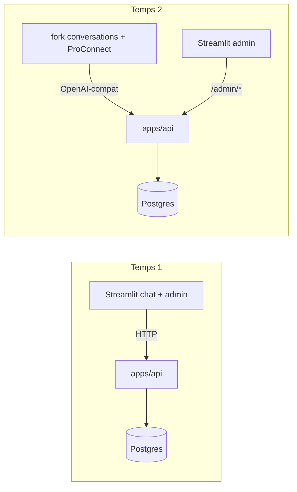

# Chantier hexagonal-split — Vue d'ensemble

> Statut : plan validé (grilling du 2026-08-21, sur la base du grilling du 2026-07-03).
> Portée : transformation du monolithe en architecture front & back hexagonale, contrat public OpenAI-compatible.
> Documents du dossier : [architecture cible](01-target-architecture.md) · [contrat API](02-api-contract.md) · [diagrammes de séquence](03-sequence-diagrams.md) · [plan de migration](04-migration-plan.md) · [environnements](05-environments.md) · [LEDGER](LEDGER.md)

## Problème

Le repo est un monolithe Streamlit : `packages/rag-pipeline` mélange métier et accès DB dans les mêmes fichiers (`pipeline.py`, `chat_logger.py`, `admin.py`), `src/ui` porte 6 000 lignes de logique couplée à Streamlit, et le seul chemin d'accès au RAG est l'import Python direct depuis `01_Chatbot.py`. Aucun consommateur externe ne peut se brancher, et le futur front (La Suite `conversations`) parle OpenAI, pas Python.

## Solution en deux temps

**Temps 1 (ce chantier)** — extraire un backend `apps/api` hexagonal exposant un contrat OpenAI-compatible ; `01_Chatbot.py` devient client HTTP de l'API ; les pages admin Streamlit deviennent clientes d'endpoints `/admin/*` ; Streamlit ne touche plus jamais Postgres.

**Temps 2 (chantier ultérieur)** — un fork de [suitenumerique/conversations](https://github.com/suitenumerique/conversations) (adapté à nos besoins, dont le feedback) remplace le chat Streamlit ; Streamlit devient une pure interface d'admin ; ProConnect vit dans le front, jamais dans l'API RAG.

## Décisions actées (avec leurs pourquoi)

| # | Décision | Pourquoi |
|---|---|---|
| D1 | **Contrat public = OpenAI-compat** (`/v1/chat/completions`, `/v1/models`), pas MCP | Le consommateur v1 est un front de chat (`conversations`) qui ne parle que ça ; un MCP retrieval céderait la génération au client et invaliderait toute la boucle qualité (évals goldset, satisfaction 3,73). Un adaptateur MCP reste possible en v2 grâce à l'hexagone. |
| D2 | **Routage ministère par le nom de modèle** : un « modèle » par ministère autorisé (`assistant-rh-matte`, …), `/v1/models` filtré par le token, fallback `default_ministry` | 100 % dans le contrat OpenAI ; `conversations` affiche nativement un sélecteur de modèle ; aucun header custom fragile. |
| D3 | **Restructuration complète** : l'hexagone vit entièrement dans `apps/api/` (`core`/`db`/`gateways`/`handlers`) ; `packages/rag-pipeline` disparaît | Choix assumé de faire propre plutôt que strangler ; le coût de conflit est contenu par la stratégie de grosse branche (D7). |
| D4 | **Le core garde l'orchestration du retrieval** (fusion, gates, sélection) ; `db` ne porte que l'accès données derrière des ports étroits | C'est la logique que les campagnes qualité optimisent — elle doit rester dans le domaine, visible et testable sans infra. |
| D5 | **Streamlit ne touche plus Postgres** : chat client HTTP, admin cliente `/admin/*` | Frontière totale : seul `apps/api/db` connaît SQL. Exception hors DB : `15_Import_Sources` parle Grist + S3 (domaine ingestion, monde séparé). |
| D6 | **Auth** : bearer par groupe (nouvelle colonne `user_groups.api_token_hash`, PBKDF2) pour le public ; `ADMIN_TOKEN` statique en env pour `/admin/*` (v1) | Minimal ; rotation admin = redeploy. Dette assumée : tokens admin en DB avec rôle à l'arrivée de ProConnect. |
| D7 | **Grosse branche d'intégration** (`feat/hexagonal-api`, créée depuis `dev`) ; `dev`/`staging`/`main` gardent l'existant intact ; merge final en merge-commit une fois la parité prouvée ; bascule après septembre 2026 | Reconstruire iso-fonctionnel d'abord, améliorer ensuite. Pas de cohabitation de deux arborescences sur `dev`. |
| D8 | **Sync minimale** : les changements structurants faits sur `dev` pendant le chantier sont reportés à la main sur la branche et notés au [LEDGER](LEDGER.md) ; court gel du pipeline sur `dev` avant l'éval de parité finale | Pas d'outillage lourd ; le LEDGER est le point de vérité de la dérive. |
| D9 | **Deux runners d'éval** : direct-core = outil de science (campagnes, overrides CLI) ; via-API = test de fidélité de l'adaptateur, exécuté aux portes (avant merge, avant bascule) | On n'évalue pas l'API pour optimiser, on l'évalue pour vérifier qu'elle est transparente. Tout écart via-API vs direct-core = bug d'adaptateur. |
| D10 | **Environnements** : dev quotidien en full local (compose API + pgvector seedé) ; parité + intégration `conversations` sur la VM homelab contre la DB staging (runs tagués `api-vm`) ; un unique déploiement smoke Scaleway avant merge | Zéro infra cloud persistante pendant le chantier ; le smoke valide Dockerfile + timeouts SSE serverless avant qu'il ne soit trop tard. |
| D11 | **Feedback** : `POST /v1/feedback`, l'id de completion = le `turn_id` du `chat_run` | La métrique produit centrale survit à la séparation sans état serveur supplémentaire. Au temps 2, le fork `conversations` appellera cet endpoint. |
| D12 | **mastra-pipeline supprimé en PR 1** | Obsolète ; le pipeline Python est la seule implémentation. |

## Inventaire de fin de chantier

**Supprimé** : `apps/mastra-pipeline` (+ scripts de conformance associés) · `packages/rag-pipeline` (migré) · les modules `src/ui/chatbot_*` du chemin direct-import · l'accès DB direct de Streamlit.

**Créé** : `apps/api/` (handlers, core, db, gateways) · `Dockerfile.api` · runner d'éval via-API · garde CI de frontière d'imports · migration `api_token_hash`.

**Conservé / adapté** : `apps/streamlit-ui` (chat client HTTP, admin cliente `/admin/*`, `15_Import_Sources` inchangé, pages éval/debug non fonctionnelles → `archive/`) · `src/goldset` + skill `run-rag-eval` repointés sur `apps/api/core` en bibliothèque · `packages/data-engineering` + `apps/data-ingestion-cli` intouchés · `packages/shared-config` conservé (data-engineering en dépend).

## Risques principaux

1. **Régression qualité silencieuse pendant les déplacements** → PRs move-only strictes, pytest vert à chaque PR, évals aux jalons (voir [plan de migration](04-migration-plan.md)).
2. **Dérive `dev` ↔ branche** (les campagnes qualité touchent `retriever.py`/`pipeline.py`) → reports notés au LEDGER, gel final court.
3. **Timeouts / comportement SSE sur Scaleway serverless** → découvert par le smoke pré-merge, pas après.
4. **Perte de la collecte de satisfaction à la bascule temps 2** → traité par le fork `conversations` (feedback branché sur `/v1/feedback`) ; prérequis de bascule, hors chantier.

## Points ouverts (non bloquants)

- Validation DINUM/DGAFP du mode de déploiement du fork `conversations` et de l'auth fork → API.
- Sort définitif des pages éval/debug archivées (réintégration via API ou abandon).
