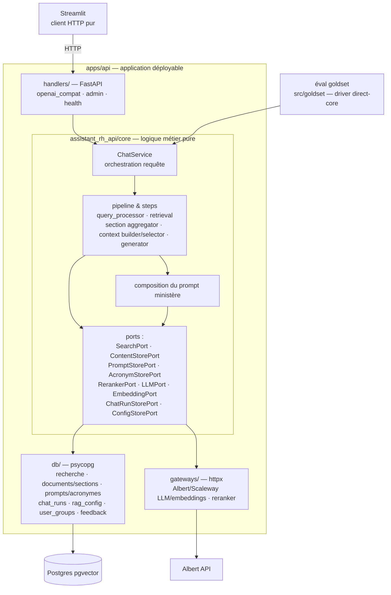

# Architecture cible — core interne à `apps/api`

> Référence : [décisions D3, D4 et D5](06-decisions.md).

## Vue d'ensemble



La composition du prompt ministère est une règle du core : elle reçoit le template et la configuration via `PromptStorePort`, puis produit le prompt transmis au générateur. Le stockage et le chargement des templates restent dans `db/`.

Le test de frontière est le suivant : **une éval goldset doit pouvoir importer `assistant_rh_api.core`, construire le `ChatService` avec ses propres adaptateurs et exécuter le pipeline sans créer l'application FastAPI**. Le module `core` n'importe jamais `handlers`, `db` ou `gateways`.

### Pourquoi le core reste dans l'application API

Le core est une frontière logique, pas nécessairement un package distribuable. Dans ce chantier :

- l'API est son seul produit et son seul cycle de release ;
- le runner goldset vit dans le même repo et peut importer un sous-module Python ;
- un deuxième `pyproject.toml`, une dépendance workspace et une publication/version séparée n'apporteraient pas d'isolation supplémentaire ;
- les contrats d'import et les tests garantissent déjà que le core reste indépendant de FastAPI, SQL et des providers.

Si un second service doit un jour consommer et versionner ce core indépendamment, `assistant_rh_api/core` pourra alors être extrait vers `packages/rag-core` sans changer ses ports.

## Arborescence cible

```text
apps/api/
├── pyproject.toml            # membre du workspace uv
├── moon.yml                  # application déployable
├── src/assistant_rh_api/
│   ├── __init__.py           # sans création d'app ni effet de bord
│   ├── core/                 # logique métier ; aucun import handlers/db/gateways
│   │   ├── chat_service.py   # cas d'usage, orchestration d'une requête
│   │   ├── pipeline.py       # orchestration des étapes
│   │   ├── run_context.py    # état strictement local à une requête
│   │   ├── steps/            # query_processor, retrieval, aggregation, selector,
│   │   │                     # context_builder, generator
│   │   ├── ports.py          # Protocol des dépendances sortantes
│   │   ├── models.py         # dataclasses domaine
│   │   ├── config.py         # schéma de config pipeline
│   │   ├── ministry_scope.py # catalogue ministères, RetrievalScope
│   │   └── prompt_policy.py  # composition pure du prompt ministère
│   ├── handlers/             # FastAPI uniquement — aucun SQL, aucun httpx métier
│   │   ├── app.py            # création de l'app, wiring des dépendances
│   │   ├── openai_compat.py  # /v1/chat/completions, /v1/models
│   │   ├── feedback.py       # /v1/feedback
│   │   ├── admin.py          # /admin/*
│   │   ├── health.py         # /healthz
│   │   └── auth.py           # bearer → groupe ; is_admin → routes admin
│   ├── db/                   # adaptateurs SQL du runtime API
│   │   ├── search.py         # recherche vectorielle/lexicale
│   │   ├── content_store.py  # documents, sections, références juridiques
│   │   ├── chat_run_store.py # chat_runs, rag_trace_events
│   │   ├── config_store.py   # rag_config, prompts, acronymes ; révisions/cache
│   │   ├── user_groups.py    # groupes, rôles et api_token_hash
│   │   ├── feedback_store.py # feedback + agrégats dashboards
│   │   └── dsn.py            # résolution DSN via shared-config
│   └── gateways/             # adaptateurs HTTP externes
│       ├── albert.py         # LLM et embeddings
│       ├── scaleway.py       # fallback LLM et embeddings
│       └── reranker.py
└── tests/
    ├── core/                 # tests purs et conformance par étape
    ├── db/                   # tests contractuels sur DB synthétique
    ├── handlers/             # contrat HTTP avec core fake/replay
    └── integration/          # assemblage complet
```

## Mapping existant → cible

Le tableau décrit une **extraction de comportement**. Il ne demande pas de déplacer les fonctions existantes telles quelles : chaque slice caractérise d'abord le comportement historique, réimplémente la règle pure derrière des ports, puis prouve la parité. L'ancien fichier reste intact tant que le chemin direct sert de rollback.

| Aujourd'hui | Cible | Travail |
|---|---|---|
| `packages/rag-pipeline/.../pipeline.py` | `assistant_rh_api/core/pipeline.py` + `RunContext` + `ChatRunStorePort` | extraire l'orchestration, sans état `last_*` |
| `.../retriever.py` | logique de fusion/gates → `core/steps/retrieval.py` ; SQL → `db/search.py` | caractériser puis réimplémenter séparément |
| `.../query_processor.py` | règles → `core/steps/query_processor.py` ; prompts/acronymes/LLM → ports | extraction comportementale |
| `.../context_builder.py` | budget/triangulation → core ; documents/références SQL → `ContentStorePort` | extraction comportementale |
| `.../section_aggregator.py` | agrégation/ranking → core ; chargement sections → `ContentStorePort` | extraction comportementale |
| `.../context_selector.py`, `generator.py` | décisions → core ; prompts/LLM → ports injectés | extraction comportementale |
| `.../reranker.py`, `llm_client.py`, `embedder.py` | `gateways/` ; seuils/gates dans le core | adaptateurs puis extraction des règles |
| `.../chat_logger.py`, `tracing.py` | `db/chat_run_store.py` derrière `ChatRunStorePort` | adaptateur DB |
| `.../admin.py` | adaptateurs/services admin + schéma dans `core/config.py` | séparer I/O et validation |
| `.../models.py`, `config.py`, `ministry_scope.py` | `core/` sans re-export ni initialisation I/O | extraction légère |
| `.../citation_extractor.py`, `conformance.py`, `db_helpers.py` | core pour les règles ; `db/` pour les helpers SQL | séparation |
| `.../feedback_analyzer.py` | service applicatif + `FeedbackStorePort` | séparation |
| `src/ui/user_groups_store.py`, `groups.py` | `db/user_groups.py`, auth handler et scope dans `core/chat_service.py` | première slice verticale |
| `src/ui/chatbot_*`, `citation_deduplicator.py`, `db_utils.py`, `llm_selector.py` | conservés pour le rollback, puis absorbés ou supprimés | nettoyage tardif |
| `src/ui/source_import.py`, `private_datasets.py` | **inchangés** (Grist + S3) | hors chantier RAG |
| `src/goldset/` | imports vers `assistant_rh_api.core` + adaptateurs d'éval | repointage après parité |
| `apps/mastra-pipeline` | supprimé | suppression immédiate |

## Audit d'isolation A5

`retriever.py` n'est pas présumé être la seule découpe non mécanique. Avant l'extraction, A5 inventorie pour chaque module :

- SQL et résolution de DSN ;
- prompts/config/acronymes dynamiques ;
- appels LLM, embeddings, reranker et observabilité ;
- caches, pools, horloges et génération d'identifiants ;
- état mutable `last_*`, diagnostics et données nécessaires au logging ;
- consommateurs dans les apps, `src/`, tests, scripts et workflows.

Chaque dépendance devient une donnée pure, un port, un adaptateur ou un élément du `RunContext`. Le [LEDGER](LEDGER.md) consigne les écarts découverts.

### Exemple : extraction du retrieval

- **`db/search.py`** exécute les requêtes SQL et retourne des chunks scorés bruts.
- **`core/steps/retrieval.py`** combine les tables, fusionne, normalise, applique les seuils et déduplique.
- Les tests caractérisent l'ancien comportement avant d'écrire la nouvelle règle ; aucun helper SQL historique n'est copié dans le core.

Si l'éval goldset peut détecter le changement d'une règle, cette règle appartient au core. Si la ligne ne fait que parler à Postgres ou à un provider, elle appartient à un adaptateur.

## Règles de frontière gardées par la CI

1. `assistant_rh_api.core` n'importe ni `handlers`, ni `db`, ni `gateways`, ni `psycopg`, `fastapi`, `httpx`, `streamlit` ou `boto3`.
2. `handlers/` n'importe pas `psycopg` et ne contient pas de logique métier ; il valide le transport puis appelle un cas d'usage.
3. `db/` et `gateways/` n'importent pas `handlers` ; ils implémentent les `Protocol` de `assistant_rh_api.core.ports`.
4. `assistant_rh_api/__init__.py` reste sans effet de bord afin que `src/goldset` importe le core sans créer FastAPI ni ouvrir de connexion.
5. Le wiring vit dans `handlers/app.py` pour l'API et dans le runner direct-core pour l'éval.
6. À l'état cible, Streamlit n'importe ni `psycopg` ni le package Python API ; il utilise HTTP. Cette garde n'est activée qu'après le canary et le retrait du rollback.

## Isolation et cycle de vie d'une requête

- Un nouveau `RunContext` est créé pour chaque appel HTTP. Il contient le ministère, `turn_id`, `trace_id`, timings, diagnostics, sources et résultat final.
- Les étapes retournent leurs résultats explicitement ; elles n'écrivent jamais dans un champ partagé comme `last_result`.
- Seuls les pools DB, clients HTTP et caches explicitement thread-safe sont partagés au niveau application ; ils ne contiennent aucune donnée utilisateur/ministère/run.
- Le pipeline synchrone s'exécute dans un worker borné et transmet ses événements à une file async. Le handler SSE reste disponible pour les pings et la détection de déconnexion.
- Une déconnexion finalise le run en `cancelled`/partiel quand cela est possible. Un succès est persisté avant le chunk terminal et `[DONE]`.

## Ce que l'hexagone rend possible ensuite

- extraction de `core/` en package autonome si un second produit en a réellement besoin ;
- adaptateur MCP retrieval sans modifier le domaine ;
- remplacement d'Albert par un autre gateway ;
- tests de charge de `db/search.py` indépendants des handlers.
