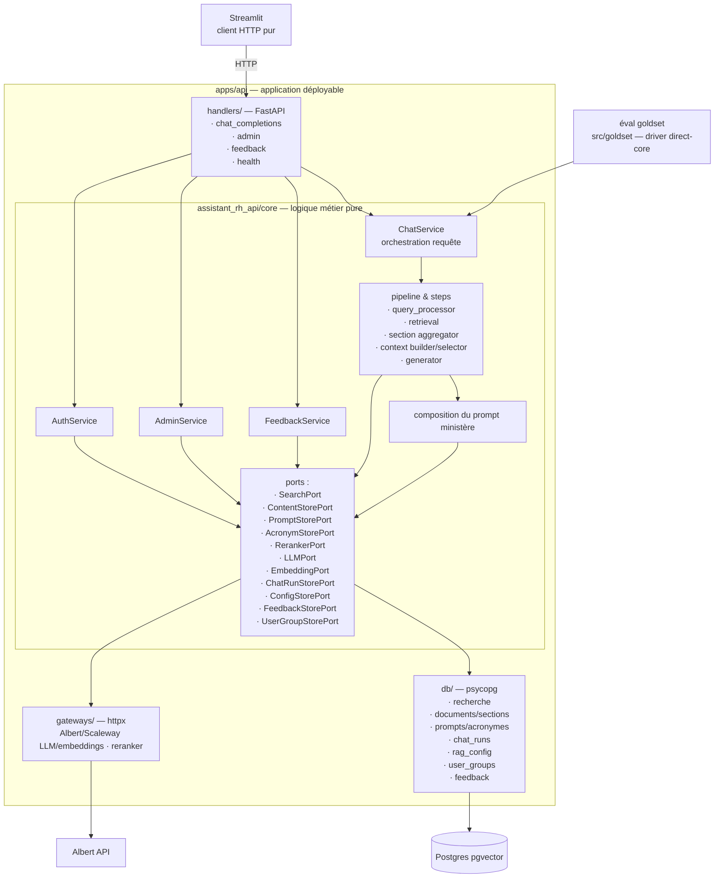

# Architecture cible — core interne à `apps/api`

> Référence : [décisions D3, D4 et D5](06-decisions.md).

## Vue d'ensemble



Le test de frontière est le suivant : **une éval goldset doit pouvoir importer `assistant_rh_api.core`, construire le `ChatService` avec ses propres adaptateurs et exécuter le pipeline sans créer l'application FastAPI**. Le module `core` n'importe jamais `handlers`, `db` ou `gateways`.

## Arborescence cible

```text
apps/api/
├── pyproject.toml            # membre du workspace uv
├── moon.yml                  # application déployable
├── src/assistant_rh_api/
│   ├── __init__.py           # sans création d'app ni effet de bord
│   ├── core/                 # logique métier ; aucun import handlers/db/gateways
│   │   ├── chat_service.py   # cas d'usages conversations
│   │   ├── feedback_service.py # cas d'usage feedback
│   │   ├── admin_service.py # cas d'usage admin rag
│   │   ├── auth_service.py # cas d'usage auth
│   │   ├── pipeline/
│   │   │   ├── __init__.py
│   │   │   ├── orchestration.py  # orchestration des étapes
│   │   │   └── steps/
│   │   │       ├── query_processor.py
│   │   │       ├── retrieval.py
│   │   │       ├── aggregation.py
│   │   │       ├── context_selector.py
│   │   │       ├── context_builder.py
│   │   │       └── generator.py
│   │   ├── ports.py          # Protocol des dépendances sortantes
│   │   ├── models.py         # dataclasses domaine
│   │   ├── config.py         # schéma de config pipeline
│   │   ├── ministry_scope.py # catalogue ministères, RetrievalScope
│   │   └── prompt_policy.py  # composition pure du prompt ministère
│   ├── handlers/             # FastAPI uniquement — aucun SQL, aucun httpx métier
│   │   ├── app.py            # création de l'app, wiring des dépendances
│   │   ├── chat_completions.py  # /v1/chat/completions
│   │   ├── models.py  # /v1/models
│   │   ├── feedback.py       # /v1/feedback
│   │   ├── admin.py          # /admin/*
│   │   ├── health.py         # /healthz
│   │   └── auth.py           # bearer → groupe ; is_admin → routes admin
│   ├── db/                   # adaptateurs SQL du runtime API
│   │   ├── search.py         # recherche vectorielle/lexicale
│   │   ├── content_store.py  # documents, sections, références juridiques
│   │   ├── chat_run_store.py # chat_runs, rag_trace_events
│   │   ├── config_store.py   # rag_config, prompts, acronymes ; révisions/cache
│   │   ├── user_groups.py    # groupes, rôles et api_token_hash
│   │   ├── feedback_store.py # feedback + agrégats dashboards
│   │   └── dsn.py            # résolution DSN via shared-config
│   └── gateways/             # adaptateurs HTTP externes
│       ├── albert.py         # LLM et embeddings
│       ├── scaleway.py       # fallback LLM et embeddings
│       └── reranker.py
└── tests/
    ├── core/                 # tests purs et conformance par étape
    ├── db/                   # tests contractuels sur DB synthétique
    ├── handlers/             # contrat HTTP avec core fake/replay
    └── integration/          # assemblage complet
```
