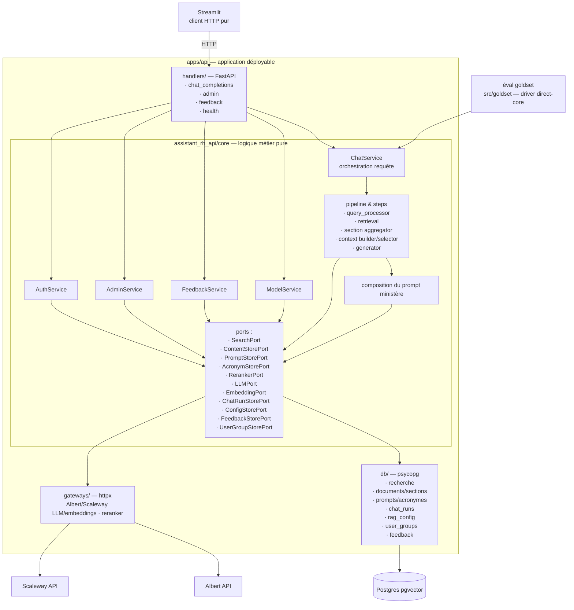

# Architecture cible — core interne à `apps/api`

> Référence : [décisions D3, D4 et D5](06-decisions.md).

## Vue d'ensemble



## Arborescence cible

```text
apps/api/
├── pyproject.toml            
├── moon.yml                  
├── src/assistant_rh_api/
│   ├── __init__.py           
│   ├── core/                 
│   │   ├── chat_service.py   
│   │   ├── feedback_service.py 
│   │   ├── admin_service.py 
│   │   ├── model_service.py 
│   │   ├── auth_service.py 
│   │   ├── pipeline/
│   │   │   ├── __init__.py
│   │   │   ├── orchestration.py  
│   │   │   └── steps/
│   │   │       ├── query_processor.py
│   │   │       ├── retrieval.py
│   │   │       ├── aggregation.py
│   │   │       ├── context_selector.py
│   │   │       ├── context_builder.py
│   │   │       └── generator.py
│   │   ├── ports.py          
│   │   ├── models.py         
│   │   ├── config.py         
│   │   ├── ministry_scope.py 
│   │   └── prompt_policy.py  
│   ├── handlers/             
│   │   ├── app.py            
│   │   ├── chat_completions.py  
│   │   ├── models.py          
│   │   ├── feedback.py          
│   │   ├── admin.py          
│   │   ├── health.py         
│   │   └── auth.py           
│   ├── db/                   
│   │   ├── search.py         
│   │   ├── content_store.py  
│   │   ├── chat_run_store.py 
│   │   ├── config_store.py   
│   │   ├── user_groups.py    
│   │   ├── feedback_store.py 
│   │   └── dsn.py            
│   └── gateways/             
│       ├── albert.py         
│       ├── scaleway.py         
│       └── reranker.py
└── tests/
    ├── core/                 
    ├── db/                   
    ├── handlers/             
    └── integration/          
```
