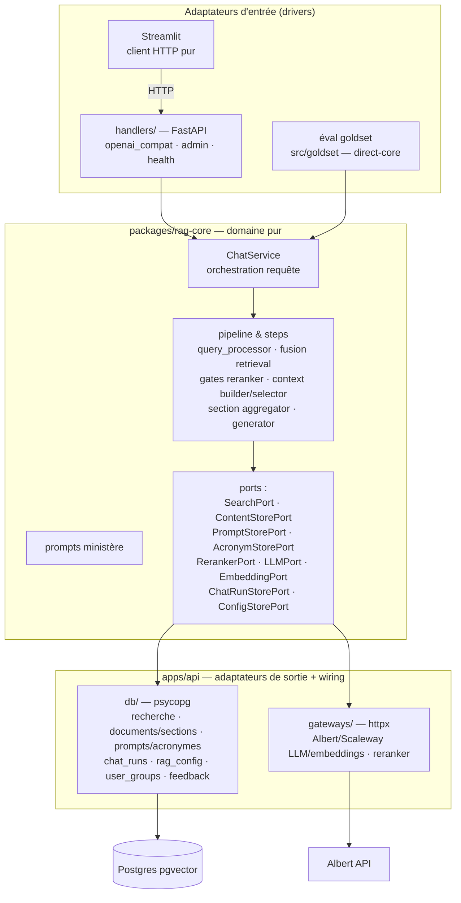

# Architecture cible — `packages/rag-core` + `apps/api`

> Référence : [00-overview.md](00-overview.md) (décisions D3, D4, D5).

## Vue d'ensemble



Le test de la frontière : **une éval goldset doit pouvoir importer `packages/rag-core` et brancher ses propres adaptateurs sans importer `apps/api`, FastAPI ni Streamlit**. `apps/api` dépend du core ; le core et les autres drivers ne dépendent jamais de l'application HTTP.

## Arborescence cible

```
packages/rag-core/
├── pyproject.toml            # membre du workspace uv
├── moon.yml                  # layer: library
└── src/assistant_rh_rag_core/
    ├── chat_service.py       # cas d'usage, orchestration d'une requête
    ├── pipeline.py           # orchestration des étapes
    ├── run_context.py        # état strictement local à une requête
    ├── steps/                # query_processor, retrieval, aggregation, selector,
    │                         # context_builder, generator
    ├── ports.py              # Protocol des dépendances sortantes
    ├── models.py             # dataclasses domaine
    ├── config.py             # schéma de config pipeline
    ├── ministry_scope.py     # catalogue ministères, RetrievalScope
    └── prompts/              # templates versionnés + rendu ministère

apps/api/
├── pyproject.toml            # membre du workspace uv, dépend de rag-core
├── moon.yml                  # layer: application
├── src/assistant_rh_api/
│   ├── handlers/             # FastAPI uniquement — aucun SQL, aucun httpx métier
│   │   ├── app.py            # création de l'app, wiring des dépendances
│   │   ├── openai_compat.py  # /v1/chat/completions, /v1/models
│   │   ├── feedback.py       # /v1/feedback
│   │   ├── admin.py          # /admin/*
│   │   ├── health.py         # /healthz
│   │   └── auth.py           # bearer → groupe ; ADMIN_TOKEN
│   ├── db/                   # adaptateurs SQL du runtime API
│   │   ├── search.py         # VectorSearchPort + LexicalSearchPort (SQL pgvector ex retriever.py)
│   │   ├── content_store.py  # documents entiers, sections, références juridiques
│   │   ├── chat_run_store.py # ex chat_logger.py (écriture chat_runs, rag_trace_events)
│   │   ├── config_store.py   # rag_config, prompts, acronymes ; révisions/cache
│   │   ├── user_groups.py    # ex user_groups_store.py + api_token_hash
│   │   ├── feedback_store.py # écriture/lecture feedback + agrégats dashboards
│   │   └── dsn.py            # résolution DSN (consomme packages/shared-config)
│   └── gateways/             # HTTP externes
│       ├── albert.py         # LLM (chat_stream), embeddings — ex llm_client.py/embedder.py
│       └── reranker.py       # ex reranker.py
└── tests/                    # migrés avec le code qu'ils couvrent
```

## Mapping existant → cible

| Aujourd'hui | Cible | Nature |
|---|---|---|
| `packages/rag-pipeline/.../pipeline.py` | `rag-core/pipeline.py` + état par requête + logging via `ChatRunStorePort` | découpe |
| `.../retriever.py` (35K) | orchestration fusion/scores → `rag-core/steps/retrieval.py` ; SQL → `apps/api/db/search.py` | découpe délicate |
| `.../query_processor.py` | logique → `rag-core/steps/query_processor.py` ; prompts/acronymes DB → ports de configuration | découpe |
| `.../context_builder.py` | budget/triangulation → core ; documents entiers/références SQL → `ContentStorePort` | découpe |
| `.../section_aggregator.py` | agrégation/ranking → core ; chargement sections SQL → `ContentStorePort` | découpe |
| `.../context_selector.py`, `generator.py` | logique → core ; prompts/LLM → ports injectés | découpe |
| `.../reranker.py`, `llm_client.py`, `embedder.py` | `apps/api/gateways/` (le seuil/gate du reranker reste dans `rag-core`) | découpe |
| `.../chat_logger.py`, `tracing.py` | `apps/api/db/chat_run_store.py` derrière `ChatRunStorePort` | découpe + port |
| `.../admin.py` | adaptateurs admin/config dans l'API + schéma dans `rag-core/config.py` | découpe |
| `.../models.py`, `config.py`, `ministry_scope.py`, `prompts/` | `rag-core/` après retrait de tous les re-exports I/O | découpe légère |
| `.../citation_extractor.py`, `conformance.py`, `db_helpers.py` | core (citation/conformance) ; adaptateurs API (helpers DB) | découpe |
| `.../feedback_analyzer.py` | service applicatif/API + lectures via `FeedbackStorePort` | découpe |
| `src/ui/user_groups_store.py`, `groups.py` | `apps/api/db/user_groups.py` + résolution scope dans `rag-core/chat_service.py` | découpe |
| `src/ui/chatbot_logging.py`, `chatbot_llm.py`, `chatbot_sources.py`, `citation_deduplicator.py`, `db_utils.py`, `llm_selector.py` | conservés pour l'ancien chemin jusqu'à la stabilité ; ensuite absorbés ou supprimés | découpe tardive |
| `src/ui/source_import.py`, `private_datasets.py` | **inchangés** (Grist + S3, domaine ingestion) | — |
| `src/goldset/` | inchangé d'emplacement, imports repointés sur `packages/rag-core` + adaptateurs d'éval | repoint |
| `apps/mastra-pipeline` | supprimé | delete |

### Audit d'isolation B0

`retriever.py` n'est pas présumé être la seule découpe non mécanique. Avant tout portage, B0 inventorie pour chaque module :

- SQL et résolution de DSN ;
- prompts/config/acronymes dynamiques ;
- appels LLM, embeddings, reranker et observabilité ;
- caches, pools, horloges et génération d'identifiants ;
- état mutable `last_*`, diagnostics et données nécessaires au logging ;
- consommateurs dans les apps, `src/`, tests, scripts et workflows.

Chaque dépendance devient soit une donnée pure passée au core, soit un port étroit, soit un état du `RunContext`. Le [LEDGER](LEDGER.md) consigne les écarts découverts et leur traitement.

### La découpe `retriever.py`

`retriever.py` reste une découpe particulièrement sensible, mais n'est plus considéré comme l'unique découpe non mécanique. Règle de partage :

- **`apps/api/db/search.py`** : les requêtes SQL (similarité vectorielle, recherche lexicale/heading, accès `rag_chunks_*` par `table_key`) — signature du port : entrée (embedding | termes, `table_keys`, `top_k`), sortie (liste de chunks scorés bruts).
- **`packages/rag-core/.../steps/retrieval.py`** : tout ce que les campagnes qualité mesurent — combinaison multi-tables, fusion des listes, normalisation des scores, seuils, dédup, anti-redondance, décisions de coupure.

Si un doute survient sur la position d'une ligne : *si l'éval goldset peut détecter son changement, c'est du core.*

## Règles de frontière (gardées par la CI)

1. `packages/rag-core` n'importe **ni** `psycopg`, **ni** `fastapi`, **ni** `httpx`, **ni** `streamlit`, **ni** `boto3`, ni `apps/api` — uniquement stdlib + pydantic/dataclasses + ses propres modules.
2. `handlers/` n'importe pas `psycopg` ; il parle au `ChatService` et aux services admin applicatifs.
3. `db/` et `gateways/` n'importent pas `handlers` ; ils implémentent les `Protocol` de `assistant_rh_rag_core.ports`.
4. À l'état cible, `apps/streamlit-ui` n'importe ni `psycopg` ni les packages Python de l'API (client HTTP pur) — exceptions : `source_import`/`private_datasets` (boto3 + Grist). Ce contrat est activé après le canary, au retrait du chemin de rollback.
5. Le wiring (quel adaptateur pour quel port) vit uniquement dans `handlers/app.py` (API) et dans le runner d'éval (direct-core).
6. `src/goldset` et les scripts peuvent dépendre de `packages/rag-core`, jamais de `apps/api`.

Mise en œuvre progressive : les contrats du core et des adaptateurs sont activés dès la PR de squelette ; le contrat interdisant DB/pipeline dans Streamlit n'est rendu bloquant qu'à la PR de nettoyage final — voir [04-migration-plan.md](04-migration-plan.md).

## Isolation et cycle de vie d'une requête

- `RunContext` contient `turn_id`, `trace_id`, timings, diagnostics provider/reranker/selector, références résolues et résultat final. Il n'est jamais partagé.
- Les services/steps sont soit créés par requête, soit immuables et reçoivent tout état via `RunContext`. Aucun handler ne lit un `last_result` partagé.
- Seuls les pools DB, clients HTTP et caches explicitement thread-safe vivent au niveau application. Leur taille, leurs timeouts et leur fermeture sont gérés au lifespan FastAPI.
- Le pipeline Python restant synchrone au début, le handler SSE l'exécute dans un worker borné et reçoit statuts/tokens via une file async. L'event loop reste libre pour les pings, la détection de déconnexion et les autres requêtes.
- Une déconnexion annule le travail quand c'est sûr et finalise un `chat_run` `cancelled`/partiel. Un succès est persisté avant le chunk terminal et `[DONE]`.

## Ce que l'hexagone rend possible ensuite (hors chantier)

- Adaptateur MCP retrieval (`handlers/mcp.py`) si un ministère veut le corpus comme outil — ~1 PR.
- Remplacement d'Albert par un autre fournisseur = 1 gateway.
- Tests de charge du retrieval sur `db/search.py` isolément.
