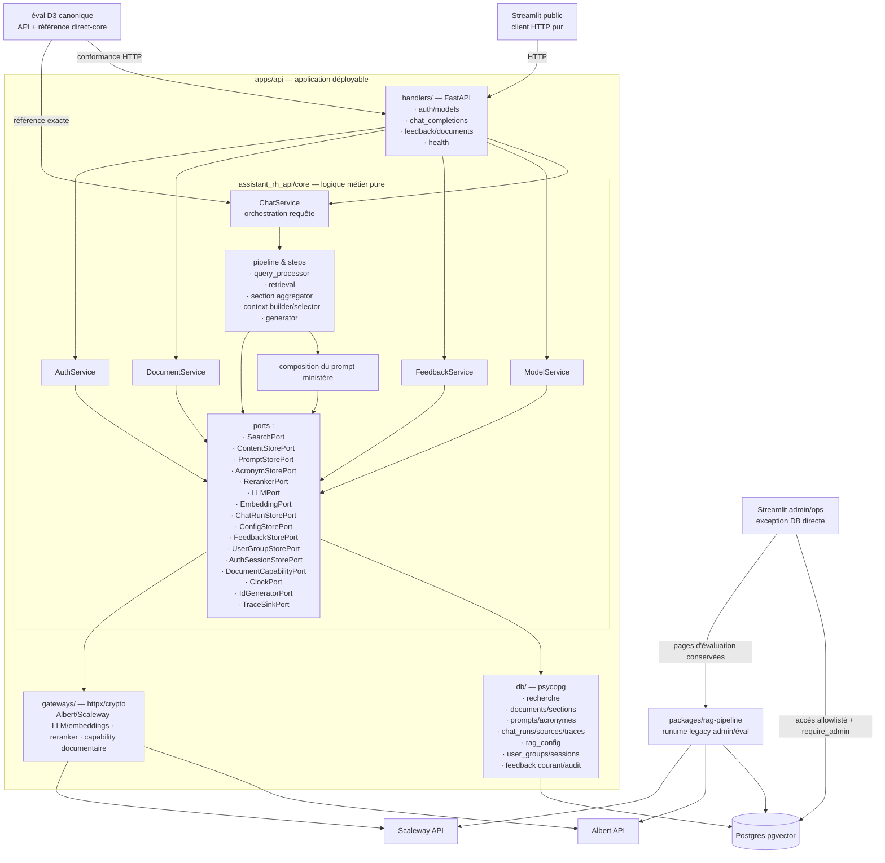

# Architecture cible M4 — core interne à `apps/api`

> Référence : [décisions D3 à D5, D17 et D19](06-decisions.md).

## Vue d'ensemble



Le nœud `packages/rag-pipeline` reste une dépendance legacy de certaines pages admin/éval après M4 ; il n'est ni sur le chemin public ni une preuve du nouveau runtime. Aucun avertissement UI n'est requis pour ces pages non publiques. Leur repointage et le retrait de ce nœud appartiennent à `admin-hardening` ; le runner D3 via API reste la preuve canonique.

## Arborescence cible

```text
apps/api/
├── pyproject.toml            
├── moon.yml                  
├── src/assistant_rh_api/
│   ├── __init__.py           
│   ├── core/                 
│   │   ├── chat_service.py   
│   │   ├── feedback_service.py 
│   │   ├── document_service.py
│   │   ├── model_service.py 
│   │   ├── auth_service.py 
│   │   ├── pipeline/
│   │   │   ├── __init__.py
│   │   │   ├── orchestration.py  
│   │   │   └── steps/
│   │   │       ├── query_processor.py
│   │   │       ├── retrieval.py
│   │   │       ├── aggregation.py
│   │   │       ├── context_selector.py
│   │   │       ├── context_builder.py
│   │   │       └── generator.py
│   │   ├── ports.py
│   │   ├── models.py         
│   │   ├── config.py         
│   │   ├── run_context.py
│   │   ├── ministry_scope.py 
│   │   └── prompt_policy.py  
│   ├── handlers/             
│   │   ├── app.py            
│   │   ├── chat_completions.py  
│   │   ├── models.py          
│   │   ├── feedback.py          
│   │   ├── documents.py
│   │   ├── health.py         
│   │   └── auth.py           
│   ├── db/                   
│   │   ├── search.py         
│   │   ├── content_store.py  
│   │   ├── chat_run_store.py 
│   │   ├── config_store.py   
│   │   ├── prompt_store.py
│   │   ├── acronym_store.py
│   │   ├── user_groups.py    
│   │   ├── auth_sessions.py
│   │   ├── feedback_store.py 
│   │   └── dsn.py            
│   └── gateways/             
│       ├── albert.py         
│       ├── scaleway.py         
│       ├── reranker.py
│       └── document_access.py
└── tests/
    ├── core/                 
    ├── db/                   
    ├── handlers/             
    └── integration/          
```

## État par requête

`ChatService` crée un `RunContext` isolé pour chaque requête. Il porte les identifiants, le scope ministère, les snapshots et révisions de config/prompts/acronymes, les résultats intermédiaires, les outcomes providers, les timings et les événements de trace. Chaque étape produit un événement structuré ; la sélection finale de sources est extraite séparément dans `chat_run_sources`. Le run, ses sources finales et ses traces sont persistés dans une même transaction avant la réponse terminale. Les pools, clients, secrets et caches process restent dans les adaptateurs et n'y figurent jamais.

Les ports et adaptateurs partagés ne stockent aucun résultat de requête. Le détail des champs, des états historiques à supprimer et des contrats de concurrence est tenu dans l'[audit d'isolation A5](07-runtime-isolation-audit.md#runcontext-minimal).
