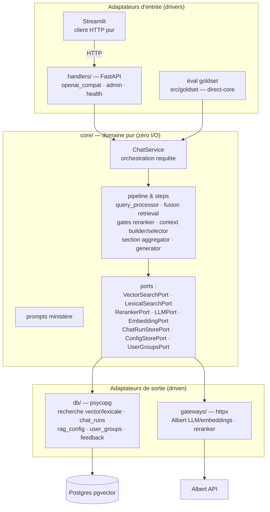

# Architecture cible — l'hexagone `apps/api`

> Référence : [00-overview.md](00-overview.md) (décisions D3, D4, D5).

## Vue d'ensemble



Le test de la frontière : **une éval goldset doit pouvoir tourner sur `core` avec des adaptateurs branchés, sans FastAPI ni Streamlit** (mode `--dsn` local actuel, rendu structurel).

## Arborescence cible

```
apps/api/
├── pyproject.toml            # membre du workspace uv
├── moon.yml
├── src/assistant_rh_api/
│   ├── handlers/             # FastAPI uniquement — aucun SQL, aucun httpx métier
│   │   ├── app.py            # création de l'app, wiring des dépendances
│   │   ├── openai_compat.py  # /v1/chat/completions, /v1/models
│   │   ├── feedback.py       # /v1/feedback
│   │   ├── admin.py          # /admin/*
│   │   ├── health.py         # /healthz
│   │   └── auth.py           # bearer → groupe ; ADMIN_TOKEN
│   ├── core/                 # domaine pur — zéro psycopg, fastapi, httpx, streamlit
│   │   ├── chat_service.py   # point d'entrée : résolution scope + process_query + run_stream
│   │   ├── pipeline.py       # ex packages/rag-pipeline pipeline.py (orchestration)
│   │   ├── steps/            # query_processor, retrieval (fusion/gates), context_builder,
│   │   │                     # context_selector, section_aggregator, generator
│   │   ├── ports.py          # les Protocol de tous les ports
│   │   ├── models.py         # dataclasses domaine (PipelineResult, ContextItem, …)
│   │   ├── config.py         # schéma de config pipeline (clés v3_*)
│   │   ├── ministry_scope.py # catalogue ministères, RetrievalScope
│   │   └── prompts/          # templates + render_ministry_prompt
│   ├── db/                   # seul endroit du repo qui parle SQL applicatif
│   │   ├── search.py         # VectorSearchPort + LexicalSearchPort (SQL pgvector ex retriever.py)
│   │   ├── chat_run_store.py # ex chat_logger.py (écriture chat_runs, rag_trace_events)
│   │   ├── config_store.py   # ex admin.py (rag_config, TTL ~15 s)
│   │   ├── user_groups.py    # ex user_groups_store.py + api_token_hash
│   │   ├── feedback_store.py # écriture/lecture feedback + agrégats dashboards
│   │   └── dsn.py            # résolution DSN (consomme packages/shared-config)
│   └── gateways/             # HTTP externes
│       ├── albert.py         # LLM (chat_stream), embeddings — ex llm_client.py/embedder.py
│       └── reranker.py       # ex reranker.py
└── tests/                    # migrés avec le code qu'ils couvrent
```

## Mapping existant → cible

| Aujourd'hui | Cible | Nature |
|---|---|---|
| `packages/rag-pipeline/.../pipeline.py` | `core/pipeline.py` + logging extrait vers `ChatRunStorePort` | découpe |
| `.../retriever.py` (35K) | orchestration fusion/scores → `core/steps/retrieval.py` ; SQL → `db/search.py` | **découpe délicate — voir ci-dessous** |
| `.../query_processor.py`, `context_builder.py`, `context_selector.py`, `section_aggregator.py`, `generator.py` | `core/steps/` | move |
| `.../reranker.py`, `llm_client.py`, `embedder.py` | `gateways/` (le seuil/gate du reranker reste dans `core`) | découpe |
| `.../chat_logger.py`, `tracing.py` | `db/chat_run_store.py` derrière `ChatRunStorePort` | move + port |
| `.../admin.py` | `db/config_store.py` + schéma dans `core/config.py` | découpe |
| `.../models.py`, `config.py`, `ministry_scope.py`, `prompts/` | `core/` | move |
| `.../citation_extractor.py`, `conformance.py`, `db_helpers.py` | `core/` (citation), `db/` (helpers) | move |
| `.../feedback_analyzer.py` | `core/feedback_analyzer.py` (analyse) + lectures via `db/feedback_store.py` | découpe |
| `src/ui/user_groups_store.py`, `groups.py` | `db/user_groups.py` + résolution scope dans `core/chat_service.py` | move |
| `src/ui/chatbot_logging.py`, `chatbot_llm.py`, `chatbot_sources.py`, `citation_deduplicator.py`, `db_utils.py`, `llm_selector.py` | absorbés par `core`/`db`/`handlers` ou supprimés | découpe |
| `src/ui/source_import.py`, `private_datasets.py` | **inchangés** (Grist + S3, domaine ingestion) | — |
| `src/goldset/` | inchangé d'emplacement, imports repointés sur `apps/api` (driver direct-core) | repoint |
| `apps/mastra-pipeline` | supprimé | delete |

### La découpe `retriever.py`

C'est la seule découpe non mécanique du chantier. Règle de partage :

- **`db/search.py`** : les requêtes SQL (similarité vectorielle, recherche lexicale/heading, accès `rag_chunks_*` par `table_key`) — signature du port : entrée (embedding | termes, `table_keys`, `top_k`), sortie (liste de chunks scorés bruts).
- **`core/steps/retrieval.py`** : tout ce que les campagnes qualité mesurent — combinaison multi-tables, fusion des listes, normalisation des scores, seuils, dédup, anti-redondance, décisions de coupure.

Si un doute survient sur la position d'une ligne : *si l'éval goldset peut détecter son changement, c'est du core.*

## Règles de frontière (gardées par la CI)

1. `core/` n'importe **ni** `psycopg`, **ni** `fastapi`, **ni** `httpx`, **ni** `streamlit`, **ni** `boto3` — uniquement stdlib + pydantic/dataclasses + ses propres modules.
2. `handlers/` n'importe pas `psycopg` ; il ne parle qu'à `core` (et aux modules d'auth).
3. `db/` et `gateways/` n'importent pas `handlers` ; ils implémentent les `Protocol` de `core/ports.py`.
4. `apps/streamlit-ui` n'importe ni `psycopg` ni `apps/api` (client HTTP pur) — exceptions : `source_import`/`private_datasets` (boto3 + Grist).
5. Le wiring (quel adaptateur pour quel port) vit uniquement dans `handlers/app.py` (API) et dans le runner d'éval (direct-core).

Mise en œuvre : `import-linter` (contrats `forbidden`) branché dans la CI dès la PR de squelette — voir [04-migration-plan.md](04-migration-plan.md), PR A2.

## Ce que l'hexagone rend possible ensuite (hors chantier)

- Adaptateur MCP retrieval (`handlers/mcp.py`) si un ministère veut le corpus comme outil — ~1 PR.
- Remplacement d'Albert par un autre fournisseur = 1 gateway.
- Tests de charge du retrieval sur `db/search.py` isolément.
