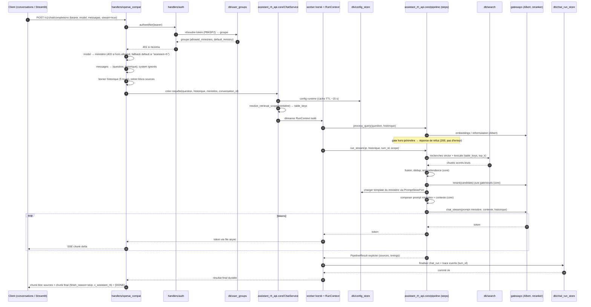
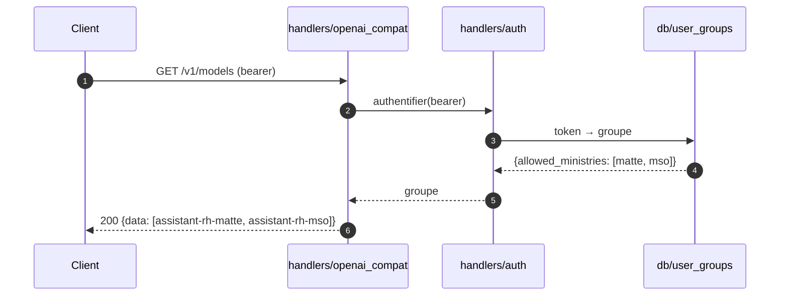
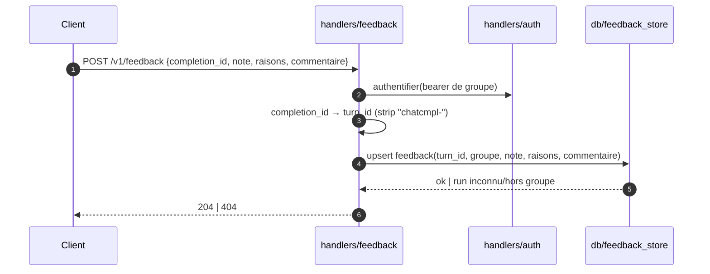
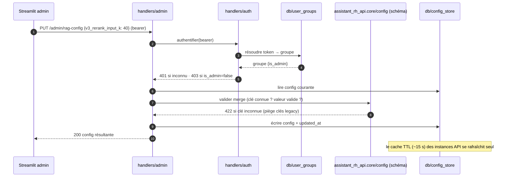
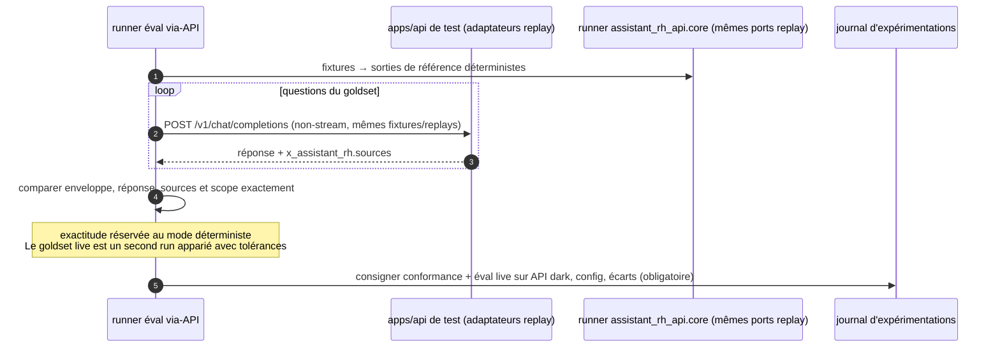

# Diagrammes de séquence

> Référence : [contrat API](02-api-contract.md) · [architecture cible](01-target-architecture.md).

## 1. `POST /v1/chat/completions` (stream)

Le chemin nominal complet, avec la résolution token → groupe → modèle → ministère.

Pendant le retrieval, le handler SSE émet `: ping` indépendamment du worker. Sur déconnexion ou erreur après démarrage, il annule ce qui peut l'être, persiste `cancelled`/`failed` et ferme sans `[DONE]`. Variante non-stream : la réponse est assemblée en un seul `chat.completion` ; le log `chat_run` précède la réponse HTTP.

## 2. `GET /v1/models`

## 3. `POST /v1/feedback`

## 4. Admin — `PUT /admin/rag-config`

## 5. Éval via-API (test de fidélité de l'adaptateur, D9)

## 6. Temps 1 → Temps 2 (vue macro)

Pendant le canary du temps 1, un rollback de configuration renvoie Streamlit vers le pipeline direct sans rebuild. Cette branche disparaît uniquement après la fenêtre de stabilité de la phase F.
