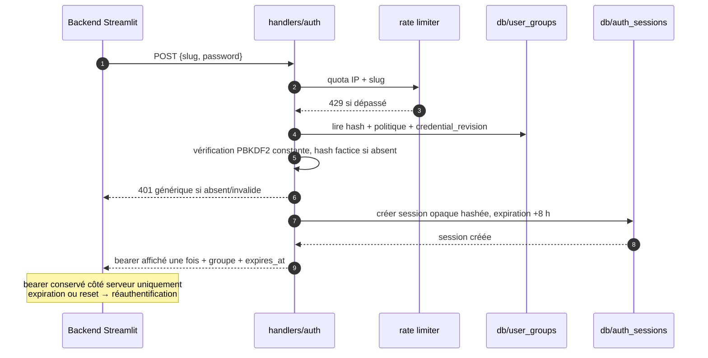
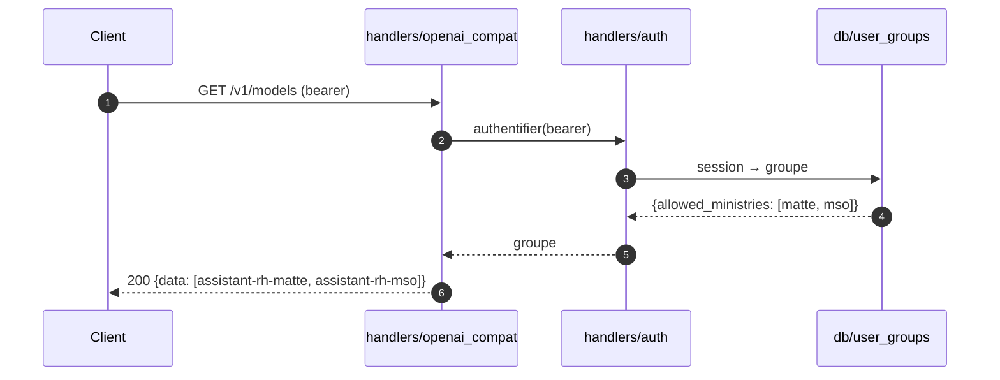
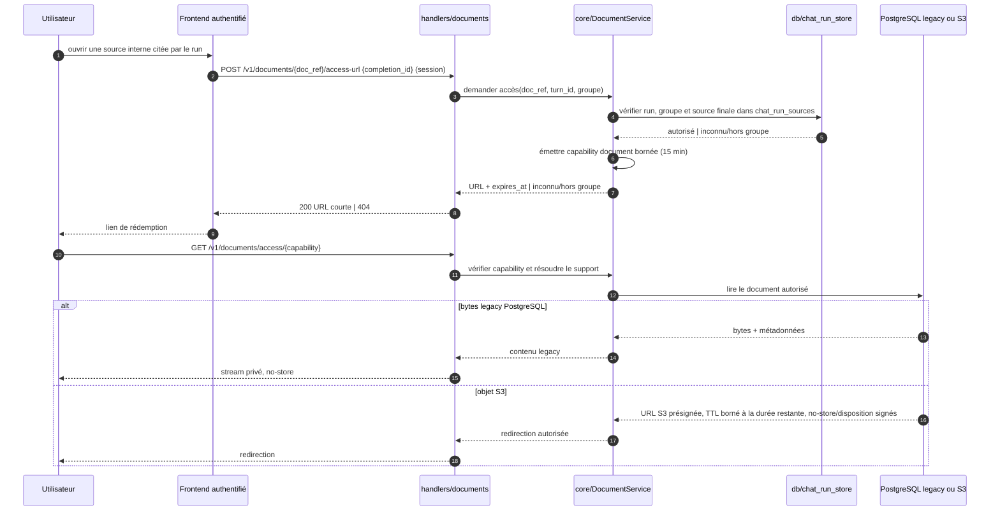
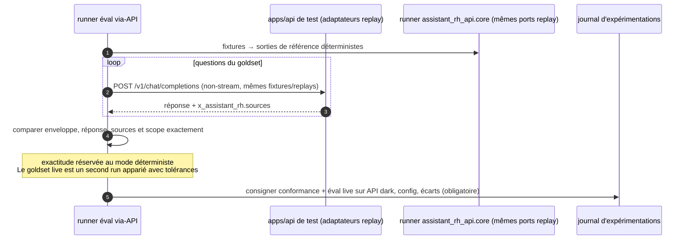
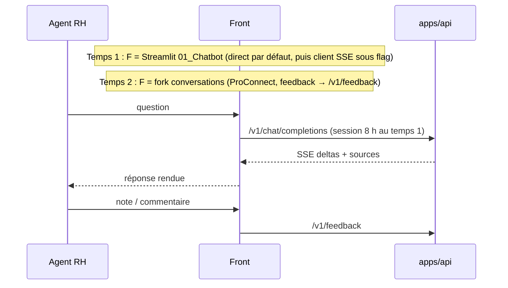

# Diagrammes de séquence

> Référence : [contrat API](02-api-contract.md) · [architecture cible](01-target-architecture.md).

## 1. `POST /v1/chat/completions` (stream)

Le chemin nominal complet, avec la résolution session → groupe → modèle → ministère.

```mermaid
sequenceDiagram
    autonumber
    participant C as Client (Streamlit ; provider conversations en test)
    participant H as handlers/openai_compat
    participant A as handlers/auth
    participant UG as db/user_groups
    participant CS as assistant_rh_api.core/ChatService
    participant W as worker borné + RunContext
    participant CFG as db/config_store
    participant P as assistant_rh_api.core/pipeline (steps)
    participant S as db/search
    participant GW as gateways (Albert, reranker)
    participant CR as db/chat_run_store (run + sources + traces)

    C->>H: POST /v1/chat/completions (bearer, model, messages, stream=true)
    H->>A: authentifier(bearer)
    A->>UG: résoudre session opaque non expirée → groupe
    UG-->>A: groupe {allowed_ministries, default_ministry}
    A-->>H: 401 si inconnu
    H->>H: model → ministère (403 si hors allowed, fallback default si "assistant-rh")
    H->>H: messages → (question, historique), system ignorés
    H->>H: borner historique (5 tours), retirer blocs sources
    H->>CS: créer requête(question, historique, ministère, conversation_id)
    CS->>CFG: config runtime (cache TTL ~15 s)
    CS->>CS: resolve_retrieval_scope(ministère) → table_keys
    CS->>W: démarrer RunContext isolé
    W->>P: process_query(question, historique)
    P->>GW: embeddings / reformulation (Albert)
    Note over P: gate hors-périmètre → réponse de refus (200, pas d'erreur)
    W->>P: run_stream(qr, historique, turn_id, scope)
    P->>S: recherches vector + lexicale (table_keys, top_k)
    S-->>P: chunks scorés bruts
    P->>P: fusion, dédup, anti-redondance (core)
    P->>GW: rerank(candidats) puis gate/seuils (core)
    P->>CFG: charger template du ministère via PromptStorePort
    P->>P: composer prompt ministère + contexte (core)
    P->>GW: chat_stream(prompt ministère, contexte, historique)
    loop tokens
        GW-->>P: token
        P-->>W: token
        W-->>H: token via file async
        H-->>C: SSE chunk delta
    end
    P-->>W: PipelineResult explicite (sources finales, timings)
    W->>CR: transaction : chat_run + chat_run_sources finales ordonnées + traces de toutes les étapes
    CR-->>W: commit ok
    W-->>H: résultat final durable
    H-->>C: chunk bloc sources + chunk final (finish_reason=stop, x_assistant_rh) + [DONE]
```

Pendant le retrieval, le handler SSE émet `: ping` indépendamment du worker. Sur déconnexion ou erreur après démarrage, il annule ce qui peut l'être, persiste `cancelled`/`failed` et ferme sans `[DONE]`. Variante non-stream : la réponse est assemblée en un seul `chat.completion` ; le log `chat_run` précède la réponse HTTP.

## 2. `POST /v1/auth/session`



## 3. `GET /v1/models`



## 4. `POST /v1/feedback`

```mermaid
sequenceDiagram
    autonumber
    participant C as Client
    participant H as handlers/feedback
    participant A as handlers/auth
    participant S as core/FeedbackService
    participant FS as db/feedback_store

    C->>H: POST /v1/feedback {completion_id, stars, raisons, commentaire}
    H->>A: authentifier(session de groupe)
    H->>H: completion_id → turn_id (strip "chatcmpl-")
    H->>S: feedback validé + groupe + turn_id
    S->>S: dériver helpful ; normaliser ; calculer l'empreinte
    S->>FS: transaction ; verrouiller le chat_run parent ; convertir stars 1–5 → stockage 0–4
    alt empreinte identique au feedback courant
        FS-->>S: no-op, aucun nouvel audit
    else charge différente
        FS->>FS: archiver précédent avec groupe + hash de session
        FS->>FS: remplacer courant ; préserver annotations humaines ; réinitialiser analyse IA
        FS-->>S: mis à jour
    end
    S-->>H: ok | run inconnu/hors groupe
    H-->>C: 204 | 404
```

## 5. Admin Streamlit — exception DB directe

```mermaid
sequenceDiagram
    autonumber
    participant ST as Streamlit admin
    participant AUTH as src/ui/admin_auth
    participant DB as PostgreSQL

    ST->>AUTH: require_admin()
    AUTH->>DB: vérifier groupe/mot de passe admin
    DB-->>AUTH: rôle is_admin
    AUTH-->>ST: stop si non-admin
    ST->>DB: lecture/mutation allowlistée
    DB-->>ST: résultat
    Note over ST,DB: aucun endpoint /admin/* requis pour M4<br/>nouveau DDL par migrations ; DDL historique en dette de durcissement
```

Chat Logs, Feedback Dashboard, Admin Config, DB/Goldset Explorer, les pages d'évaluation, Pipeline Timeline et User Groups conservent ce chemin après M4. Leur migration vers une API, Grafana/Tempo, LangSmith ou RAG-ops est un chantier séparé.

## 6. Document interne — URL courte créée au clic



La capability n'est ni persistée ni ajoutée au chat et sa valeur est masquée dans les logs d'accès. Le frontend conserve `doc_ref` + `completion_id` et demande une capability fraîche à chaque clic. Si la première rédemption échoue, il refait une fois le `POST` avec sa session encore valide puis réessaie ; les contrôles d'autorisation sont donc rejoués et l'ancien lien ne se renouvelle jamais lui-même.

## 7. Éval via-API (test de fidélité de l'adaptateur, D3)



## 8. Temps 1 → Temps 2 (vue macro)



Pendant le canary du temps 1, un rollback de configuration renvoie Streamlit vers le pipeline direct sans rebuild. Cette branche disparaît uniquement après la fenêtre de stabilité de la phase F.
