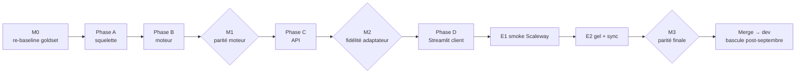

# Plan de migration — séquence de PRs

> Référence : [00-overview.md](00-overview.md) (décisions D7, D8, D9). Avancement tenu au [LEDGER.md](LEDGER.md).

## Modèle de livraison

- Branche d'intégration **`feat/hexagonal-api`**, créée depuis `dev`. Toutes les PRs du chantier la ciblent ; revue PR par PR.
- `dev` / `staging` / `main` continuent de faire tourner l'existant, intact, jusqu'au merge final.
- Merge final : **merge-commit** (jamais squash) de `feat/hexagonal-api` → `dev`, une fois la parité prouvée (jalon M3). Bascule des consommateurs après septembre 2026.
- Reconstruction **iso-fonctionnelle** : aucune amélioration de pipeline dans ce chantier ; les idées notées au LEDGER pour après.

## Règles invariantes (toutes les PRs)

1. **Move-only ≠ comportement** : une PR déplace du code sans changer la logique, ou change du comportement — jamais les deux.
2. **pytest vert à chaque PR** ; les tests migrent avec le code qu'ils couvrent.
3. La garde de frontière d'imports (import-linter, posée en A2) passe à chaque PR.
4. Chaque PR amende le [LEDGER.md](LEDGER.md) (section Avancement).
5. Format PR : `## Problème` / `## Solution` (+ mermaid si utile).

## Politique de synchronisation avec `dev` (D8)

- Sync **à la demande** (pas de cadence imposée) : merge de `dev` dans `feat/hexagonal-api` quand un changement structurant atterrit sur `dev`.
- Tout changement de `packages/rag-pipeline` ou `src/ui` mergé sur `dev` pendant le chantier est **reporté à la main** vers l'arborescence `apps/api` et **noté** dans le LEDGER (section Reports depuis dev). Un report non fait = dette de parité visible.
- **Gel final** : 5 jours ouvrés avant l'éval de parité M3, gel des changements pipeline sur `dev` (les campagnes qualité atterrissent avant ou attendent).

---

## Phase 0 — préparation (sur `dev`)

| PR / action | Contenu | Sortie de phase |
|---|---|---|
| **PR 0** (celle-ci) | Docs du plan (`docs/architecture/hexagonal-split/`) → `dev` | Plan visible et amendable |
| **Jalon M0** | **Re-baseline goldset** sur `dev` (direct-core actuel, config staging), consignée au journal d'expérimentations | La référence de parité du chantier |
| Action | Créer `feat/hexagonal-api` depuis `dev` ; vérifier que la CI tourne sur les PRs ciblant cette branche (ajuster les triggers sinon) | Branche prête |

## Phase A — nettoyage + squelette

| PR | Contenu | Type |
|---|---|---|
| **A1** | Suppression `apps/mastra-pipeline`, `scripts/run_mastra_conformance.py`, références moon/pnpm/CI | delete |
| **A2** | Squelette `apps/api` (membre workspace uv, FastAPI minimal, `/healthz`, `moon.yml`, `Dockerfile.api`) + **import-linter en CI** (les 5 règles de [01-target-architecture.md](01-target-architecture.md)) + `LEDGER.md` initialisé | structure |

## Phase B — migration du moteur (move-only par étape, `packages/rag-pipeline` → `apps/api`)

Ordre choisi pour que chaque PR laisse un état importable et testé ; pendant la phase B, `packages/rag-pipeline` continue d'exister côté Streamlit — la suppression n'arrive qu'en D2.

| PR | Contenu | Découpe |
|---|---|---|
| **B1** | `core/` : `models.py`, `config.py`, `ministry_scope.py`, `prompts/`, `ports.py` (nouveaux Protocol) | move + création ports |
| **B2** | `db/` : `dsn.py`, helpers bas niveau (`db_helpers`), `user_groups.py` (depuis `src/ui/user_groups_store.py`) | move |
| **B3** | **Découpe `retriever.py`** : SQL → `db/search.py`, orchestration/fusion/anti-redondance → `core/steps/retrieval.py` (voir règle de partage en [01](01-target-architecture.md)) | découpe délicate — revue renforcée |
| **B4** | `gateways/` : `albert.py` (llm_client + embedder), `reranker.py` ; les seuils/gates restent en `core` | découpe |
| **B5** | `core/steps/` : `query_processor`, `context_builder`, `context_selector`, `section_aggregator`, `generator`, `citation_extractor` | move |
| **B6** | `db/chat_run_store.py` (chat_logger + tracing) derrière `ChatRunStorePort` ; `db/config_store.py` + validation dans `core/config.py` (ex `admin.py`) | découpe |
| **B7** | `core/pipeline.py` + `core/chat_service.py` (résolution scope sortie de `src/ui`) ; `src/goldset` repointé sur `apps/api` (runner **direct-core**) | assemblage |

**Jalon M1 — parité moteur** : éval goldset direct-core sur la nouvelle arborescence vs baseline M0. Écart attendu = nul (mêmes algorithmes déplacés). Consigné au journal + LEDGER. On ne passe pas en phase C sans M1 au vert.

## Phase C — l'API

| PR | Contenu |
|---|---|
| **C1** | Migration SQL `user_groups.api_token_hash` + `handlers/auth.py` (bearer → groupe, `ADMIN_TOKEN`) + `GET /v1/models` |
| **C2** | `POST /v1/chat/completions` non-stream : mapping messages → (question, historique), routage model → ministère, assemblage sources (bloc markdown + `x_assistant_rh`), log `chat_runs` |
| **C3** | Streaming SSE (chunks OpenAI, keep-alive retrieval, chunk sources final) |
| **C4** | `POST /v1/feedback` + `/healthz` complet |
| **C5** | `/admin/*` : rag-config (GET/PUT + validation), user-groups (CRUD + rotate-token), chat-runs (liste/détail), feedback/stats |
| **C6** | **Runner éval via-API** (livrable D9) : goldset → `/v1/chat/completions`, comparaison aux sorties direct-core à config figée |

**Jalon M2 — fidélité de l'adaptateur** : runner via-API sur la VM homelab contre la DB staging (runs tagués `source=api-vm`), comparé au direct-core même config. Tout écart = bug d'adaptateur à corriger avant la phase D.

## Phase D — Streamlit client HTTP

| PR | Contenu |
|---|---|
| **D1** | `01_Chatbot.py` → client SSE de l'API (plus aucun import du pipeline) ; pages éval/debug non fonctionnelles → `archive/` |
| **D2** | Pages admin (`04`, `13`, `14`, `02`, `03`) → clientes `/admin/*` ; suppression de l'accès Postgres de Streamlit ; **suppression de `packages/rag-pipeline`** et des `src/ui/chatbot_*` résiduels ; balayage final des imports |

## Phase E — pré-merge

| Étape | Contenu |
|---|---|
| **E1** (PR) | Workflow `workflow_dispatch` de déploiement smoke Scaleway (container éphémère) ; valider cold start, mémoire, **timeouts SSE serverless** ; corrections éventuelles ; extinction |
| **E2** | Gel `dev` (5 j ouvrés) + sync finale + reports soldés (LEDGER à zéro dette) |
| **Jalon M3 — parité finale** | Éval goldset via-API **et** direct-core vs baseline M0 (re-jouée si `dev` a bougé) ; consignation journal + LEDGER |
| **E3** | Merge-commit `feat/hexagonal-api` → `dev` ; puis promotion staging habituelle ; mise en service Scaleway (API min-scale=1, Streamlit scale-to-zero) |

## Après le chantier (hors périmètre, pour mémoire)

- Bascule temps 2 : fork `conversations` (feedback → `/v1/feedback`, ProConnect) ; prérequis : spike d'intégration + décision DINUM/DGAFP.
- Suppression du chat Streamlit ; Streamlit = admin pur.
- Tokens admin en DB avec rôle (fin de l'`ADMIN_TOKEN` statique).
- Améliorations pipeline notées au LEDGER pendant la reconstruction.

## Récapitulatif des jalons

