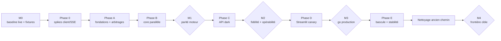

# Plan de migration — remplacement parallèle et réversible

> Référence : [00-overview.md](00-overview.md) (décisions D7, D8, D9, D14). Avancement tenu au [LEDGER.md](LEDGER.md).

## Modèle de livraison

- Les PRs additives ciblent **`dev`** selon le flux Git habituel. `packages/rag-core` et `apps/api` peuvent donc suivre la CI, staging et les déploiements sans devenir immédiatement le chemin de production.
- `packages/rag-pipeline` et le Streamlit direct restent fonctionnels et sélectionnés par défaut pendant toute la reconstruction.
- L'API est construite, déployée dark et observée à côté de l'existant. Streamlit ne passe en HTTP que derrière un feature flag réversible.
- La suppression de l'ancien package, des imports directs et de l'accès DB Streamlit est une phase de nettoyage **postérieure** à une fenêtre de stabilité en production.
- Reconstruction iso-fonctionnelle : aucune amélioration de qualité pipeline dans le portage. Les idées sont consignées au LEDGER pour après.

## Règles invariantes

1. Une PR porte une seule intention reviewable : squelette, inventaire/port, adaptateur, endpoint ou bascule — jamais un déplacement massif mêlé à un changement qualité.
2. Le chemin de production existant et ses tests restent verts tant que le feature flag pointe dessus ; les tests du nouveau chemin s'ajoutent sans remplacer prématurément les anciens.
3. La frontière `rag-core` est gardée dès sa création. Les interdictions DB/pipeline dans Streamlit ne deviennent bloquantes qu'au nettoyage final.
4. Chaque PR qui porte ou compare du comportement amende le [LEDGER.md](LEDGER.md).
5. Format PR : `## Problème` / `## Solution` (+ mermaid si utile), tests exécutés et preuve de parité concernée.
6. Les migrations DB sont versionnées, idempotentes et testées sur une base locale synthétique avant staging.

## Politique de synchronisation avec le pipeline existant

- Tout changement comportemental de `packages/rag-pipeline` ou du chemin chat Streamlit atterrissant pendant le chantier est inscrit dans **Reports depuis le runtime existant**.
- Le report vers `packages/rag-core` cite le commit source, les tests portés et le résultat de conformance. Un report non fait reste une dette visible.
- Les corrections urgentes continuent normalement sur l'ancien runtime ; la reconstruction ne bloque pas la production.
- Gel final court : 5 jours ouvrés avant M3, les changements qualité pipeline attendent ou sont reportés avant de relancer les preuves.

---

## Phase 0 — baseline et spikes bloquants

| PR / action | Contenu | Sortie de phase |
|---|---|---|
| **PR 0** (celle-ci) | Plan amendé (`docs/architecture/hexagonal-split/`) → `dev` | Stratégie parallèle, réversible et vérifiable |
| **M0a** | Baseline goldset live du runtime existant, config et snapshot corpus identifiés, consignée au journal | Référence de qualité, avec métriques/tolérances plutôt qu'égalité textuelle |
| **M0b** | Capturer les fixtures/replays et sorties d'étapes déterministes nécessaires à la conformance | Référence exacte pour le portage |
| **A1** | Supprimer `apps/mastra-pipeline`, ses scripts strictement Mastra et les références moon/pnpm/CI devenues mortes | Nettoyage indépendant, tests Python inchangés |
| **A2** | Spike contrat : serveur minimal Chat Completions + SDK OpenAI + vraie instance `conversations` ; valider messages, modèles, erreurs, SSE, `[DONE]`, sources et auth backend → API | Contrat supporté documenté et tests d'intégration conservés |
| **A3** | Spike Scaleway précoce : container éphémère avec retrieval simulé lent, pings SSE, worker, déconnexion et erreur post-headers | Go/no-go sur l'architecture de streaming serverless |

On ne commence pas le portage massif avant A2/A3 : une contrainte client ou plateforme doit pouvoir modifier le contrat à faible coût.

## Phase A — fondations et arbitrages produit

| PR | Contenu |
|---|---|
| **A4** | Squelettes `packages/rag-core` et `apps/api` (workspace uv/moon), FastAPI minimal, `/healthz`, `Dockerfile.api`, import-linter pour core/adaptateurs, tests de packaging |
| **A5** | Schéma runtime local complet et synthétique : migrations/fixtures pour auth, config, prompts, acronymes, chat runs, traces et feedback, sans copier de données personnelles de staging |
| **A6** | ADR auth/cutover : implémentation lookup/rotation des bearers, provisioning secret côté serveur Streamlit, rotation testée sans exposition navigateur ; cette ADR est un prérequis de D1, pas du déploiement dark |
| **A7** | Matrice de parité Streamlit ci-dessous, arbitrée avec le produit ; endpoints étroits listés pour chaque page conservée |

### Matrice de parité Streamlit

| Page/fonction | Cible proposée | Décision requise avant |
|---|---|---|
| `01_Chatbot` | Client Chat Completions SSE sous feature flag, ancien chemin en rollback | D1 |
| `02_Chat_Logs` | `/admin/chat-runs` liste/détail | D2 |
| `03_Feedback_Dashboard` | `/admin/feedback`, stats, analyse et exports reconstruits côté client | D2 |
| `04_Admin_Config` | RAG config + CRUD prompts + CRUD acronymes + health via API | D2 |
| `05_DB_Explorer` | Endpoint document/chunk étroit, maintien temporaire ou archivage approuvé — jamais SQL générique | A7 |
| `06_Goldset_Explorer` | API goldset dédiée, outil séparé ou maintien temporaire | A7 |
| `08`, `09`, `10` évals | CLI/outils dédiés, maintien temporaire ou archivage approuvé | A7 |
| `12_Pipeline_Timeline` | Détail run + `/trace` | D2 |
| `13_admin` | Redirection conservée vers la page admin cible | D2 |
| `14_User_Groups` | CRUD complet, reset password, suppression protégée, rotation bearer | D2 |
| `15_Import_Sources` | Inchangé (Grist + S3), hors frontière DB RAG | — |
| `_PDF_Viewer` | Endpoint document/PDF étroit ou URL signée ; sinon retrait approuvé | A7 |

## Phase B — construction parallèle du moteur

Le nouveau core est écrit dans `packages/rag-core`. Aucun fichier de `packages/rag-pipeline` n'est supprimé ni transformé en façade pendant cette phase ; l'ancien runtime reste la référence servie.

| PR | Contenu | Preuve minimale |
|---|---|---|
| **B0** | Inventaire exhaustif I/O/état/consommateurs : SQL, DSN, prompts, acronymes, config, providers, tracing, caches, `last_*`, scripts, workflows et pages Streamlit. Pour chaque dépendance : port, donnée pure, `RunContext`, adaptateur ou retrait approuvé | Inventaire reviewé et reporté dans le mapping cible |
| **B1** | Modèles domaine, config pure, ministère, `RunContext`, identifiants/horloge injectables et premiers ports issus de B0 | Tests purs + import-linter |
| **B2** | Adaptateurs de lecture : recherche vector/lexicale, documents, sections et références juridiques | Tests SQL contractuels sur DB synthétique |
| **B3** | Retrieval : orchestration/fusion/gates dans core, SQL dans adaptateurs | Fixtures d'étape exactes + déterminisme des égalités |
| **B4** | Query processor : logique dans core, prompts/acronymes/LLM derrière ports | Replays intent/reformulation exacts |
| **B5** | Section aggregator + context builder : logique qualité dans core, accès sections/documents/références derrière `ContentStorePort` | Fixtures agrégation/contexte exactes |
| **B6** | Gateways LLM, embeddings et reranker ; fallback et diagnostics rendus dans `RunContext`, aucun `last_*` partagé | Tests provider/fallback/concurrence |
| **B7** | Context selector + generator, prompts injectés/révisionnés | Replays + tests anti-hallucination/no-answer |
| **B8** | `Pipeline`/`ChatService`, logging/tracing via ports, runner direct-core et repointage du skill d'éval vers la nouvelle bibliothèque | Conformance bout en bout déterministe |

**Jalon M1 — parité moteur** :

- conformance déterministe ancien runtime → nouveau core : sorties d'étapes et résultat structuré exacts sur les fixtures M0b ;
- goldset live apparié nouveau core vs baseline M0a : pas de régression au-delà des tolérances décidées et écarts expliqués ;
- tests de concurrence prouvant que deux ministères/runs simultanés ne mélangent ni résultat, ni prompt, ni trace.

On ne passe pas en phase C si M1 n'est pas consigné et vert.

## Phase C — API parallèle puis déploiement dark

| PR | Contenu |
|---|---|
| **C1** | Migration auth API + `handlers/auth.py` + `GET /v1/models` ; lookup/rotation bornés et tests d'isolation groupe/ministère |
| **C2** | `POST /v1/chat/completions` non-stream : validation, fenêtre d'historique 5 tours, retrait des blocs sources, routage modèle, réponse/sources/log durable |
| **C3** | Streaming SSE : worker borné, file async, pings, erreurs post-headers, annulation et persistance avant `[DONE]` |
| **C4** | `POST /v1/feedback` : ownership groupe/run, raisons structurées, enrichissement goldset et déclenchement durable de l'analyse |
| **C5** | Admin config : rag-config, prompts, acronymes, groupes, reset password et rotation bearer |
| **C6** | Admin observabilité : chat-runs, traces, feedback détaillé/stats/analyse, plus endpoints décidés en A7 |
| **C7** | Runner via-API : conformance déterministe de l'enveloppe/adaptateur + mode goldset live séparé ; tests SDK OpenAI/`conversations` conservés |
| **C8** | Workflow de déploiement API dark staging ; API joignable seulement par les testeurs/clients autorisés, aucun trafic Streamlit par défaut |

**Jalon M2 — fidélité API et opérabilité** :

- exactitude core ↔ API en mode déterministe ;
- qualité live dans les tolérances M1 ;
- streaming réel, erreurs, déconnexions, logs et feedback testés sur l'API dark ;
- métriques de latence, erreurs, connexions DB et fallback provider visibles avant tout client de production.

## Phase D — Streamlit sous feature flags

| PR / étape | Contenu |
|---|---|
| **D1** | Client Chat Completions SSE + provisioning serveur des bearers ; `RAG_CHAT_BACKEND=direct|api`, défaut `direct` ; tests des deux chemins |
| **D2** | Clients admin HTTP selon la matrice A7 ; accès DB existant conservé uniquement derrière le mode de rollback, pas de suppression |
| **D3** | Déployer le Streamlit dual-path à côté de l'API dark en staging ; activer `api` pour un canary borné, comparer qualité, satisfaction, erreurs, latence et complétude des logs |
| **D4** | Fenêtre de stabilité staging de 5 jours ouvrés minimum ; exercices de rollback `api → direct` et rotation de tokens |

**Jalon M3 — autorisation de bascule production** : M2 toujours vert, canary sans régression inexpliquée, fonctions admin retenues disponibles, rollback testé, dette de report LEDGER à zéro.

## Phase E — production, stabilité, puis nettoyage

| Étape | Contenu |
|---|---|
| **E1** | Promouvoir l'API et le Streamlit dual-path en production avec le défaut encore sur `direct` ; smoke API dark production |
| **E2** | Activer `RAG_CHAT_BACKEND=api` par configuration ; conserver `direct` pendant la fenêtre de stabilité convenue et monitorer les mêmes métriques que D3 |
| **E3** | Après validation explicite de stabilité : supprimer `packages/rag-pipeline`, le chemin direct, les accès DB Streamlit, CSV fallbacks obsolètes et les flags de rollback ; archiver uniquement les pages approuvées en A7 |
| **E4** | Activer la garde finale interdisant DB/pipeline dans Streamlit ; balayage imports/usages dans apps, packages, `src`, tests, scripts, docs et workflows |
| **M4 — cible atteinte** | Conformance + goldset final, admin smoke, frontières CI et déploiement standard verts ; consignation finale journal + LEDGER |

## Après le chantier

- Temps 2 : fork `conversations` complet avec ProConnect et feedback ; le spike A2 réduit le risque technique mais ne remplace pas la décision DINUM/DGAFP.
- Suppression du chat Streamlit ; Streamlit devient admin pur.
- Tokens admin en DB avec rôles, fin de l'`ADMIN_TOKEN` statique.
- Améliorations pipeline notées au LEDGER pendant la reconstruction.

## Récapitulatif des jalons

