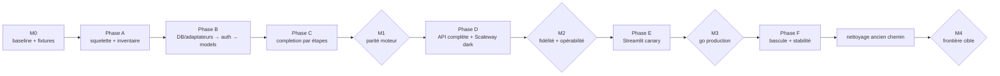

# Plan de migration — adaptateurs d'abord, extraction par slices

> Référence : [décisions de migration D7 à D10, D12 et D14](06-decisions.md). Avancement tenu au [LEDGER.md](LEDGER.md).

## Modèle de livraison

- Les PRs additives ciblent `dev` selon le flux Git habituel. `apps/api` atterrit progressivement sans devenir immédiatement le chemin de production.
- `packages/rag-pipeline` et le Streamlit direct restent fonctionnels et sélectionnés par défaut pendant toute la reconstruction.
- Les fondations DB et les adaptateurs sont construits avant l'extraction métier.
- L'extraction avance ensuite par slices observables : auth, `/v1/models`, contrat de completion, query processor, retrieval, construction de contexte, génération et streaming.
- L'API est déployée dark sur Scaleway seulement lorsqu'elle est complète sur la VM homelab. Streamlit passe en HTTP derrière un feature flag réversible.
- L'ancien package et l'accès DB Streamlit ne sont supprimés qu'après une fenêtre de stabilité en production.

## Règles invariantes

1. **Extraire, pas déplacer** : on caractérise le comportement existant, on écrit la règle pure dans `assistant_rh_api.core` avec ses ports, puis on prouve la parité. Une fonction historique couplée à SQL, à un provider ou à un champ `last_*` n'est jamais copiée telle quelle dans le core.
2. Une PR porte une slice reviewable : contrat/fixture, adaptateur, règle métier ou handler. Elle ne mélange pas extraction et amélioration qualité.
3. Le chemin de production existant et ses tests restent verts tant que le feature flag pointe dessus. Les nouveaux tests s'ajoutent sans remplacer prématurément les anciens.
4. La frontière `assistant_rh_api.core` est gardée dès sa création. L'interdiction DB/pipeline dans Streamlit ne devient bloquante qu'au nettoyage final.
5. Chaque PR qui porte ou compare du comportement amende le [LEDGER.md](LEDGER.md).
6. Les migrations DB sont versionnées, idempotentes et testées sur une base locale synthétique avant la VM/staging.

## Synchronisation avec le runtime existant

- Tout changement comportemental de `packages/rag-pipeline` ou du chemin chat Streamlit est inscrit dans **Reports depuis le runtime existant**.
- Le report vers `assistant_rh_api.core` cite le commit source, la slice concernée, les tests de caractérisation et la conformance.
- Les corrections urgentes continuent normalement sur l'ancien runtime ; elles ne sont jamais bloquées par la reconstruction.
- Pendant les 5 jours ouvrés avant M3, les changements qualité attendent ou sont reportés avant de relancer les preuves.

## Phase 0 — références et contrat

| PR / action | Contenu | Sortie |
|---|---|---|
| **PR 0** (celle-ci) | Plan amendé et décisions séparées | Séquence et frontières reviewables |
| **M0a** | Baseline goldset live du runtime existant, avec config et snapshot corpus identifiés | Référence de qualité comparée par métriques/tolérances |
| **M0b** | Fixtures/replays et sorties d'étapes déterministes du runtime existant | Référence exacte pour chaque extraction |
| **A1** | Supprimer `apps/mastra-pipeline`, ses scripts strictement Mastra et ses références CI/moon/pnpm mortes | Nettoyage indépendant |
| **A2** | Spike local/homelab : serveur minimal Chat Completions testé avec SDK OpenAI et vraie instance `conversations` | Sous-ensemble du contrat, erreurs, SSE, sources et auth documentés |
| **A3** | Matrice de parité Streamlit ci-dessous, arbitrée avec le produit | Sort explicite de chaque page et endpoints étroits à construire |

Le spike A2 utilise uniquement le local et la VM homelab. Il valide notre implémentation SSE ; les particularités du proxy Scaleway sont validées lors du premier déploiement dark, pas dans un troisième environnement temporaire.

### Matrice de parité Streamlit

| Page/fonction | Cible proposée | Décision requise avant |
|---|---|---|
| `01_Chatbot` | Client Chat Completions SSE sous feature flag, ancien chemin en rollback | E1 |
| `02_Chat_Logs` | `/admin/chat-runs` liste/détail | PR D2 |
| `03_Feedback_Dashboard` | `/admin/feedback`, stats, analyse et exports reconstruits côté client | PR D2 |
| `04_Admin_Config` | RAG config + CRUD prompts + CRUD acronymes + health via API | PR D2 |
| `05_DB_Explorer` | Endpoint document/chunk étroit, maintien temporaire ou archivage approuvé — jamais SQL générique | A3 |
| `06_Goldset_Explorer` | API goldset dédiée, outil séparé ou maintien temporaire | A3 |
| `08`, `09`, `10` évals | CLI/outils dédiés, maintien temporaire ou archivage approuvé | A3 |
| `12_Pipeline_Timeline` | Détail run + `/trace` | PR D2 |
| `13_admin` | Redirection vers la page admin cible | PR D2 |
| `14_User_Groups` | CRUD, reset password, suppression protégée, rôles et rotation bearer | PR D2 |
| `15_Import_Sources` | Inchangé (Grist + S3), hors frontière DB RAG | — |
| `_PDF_Viewer` | Endpoint document/PDF étroit ou URL signée ; sinon retrait approuvé | A3 |

## Phase A — squelette et inventaire

| PR | Contenu | Preuve minimale |
|---|---|---|
| **A4** | Squelette unique `apps/api` avec `assistant_rh_api/{core,handlers,db,gateways}`, `/healthz`, packaging uv/moon et `Dockerfile.api` | Import du core sans création FastAPI ; build local |
| **A5** | Inventaire exhaustif I/O/état/consommateurs : SQL, DSN, prompts, acronymes, config, providers, tracing, caches, `last_*`, scripts, workflows et pages | Chaque dépendance classée : donnée pure, port, adaptateur, `RunContext` ou retrait approuvé |
| **A6** | Schéma runtime local synthétique : config, prompts, acronymes, groupes/tokens/rôles, chat runs, traces et feedback | Migrations sur DB vierge + fixtures sans données personnelles |

## Phase B — DB, adaptateurs, auth puis modèles

Cette phase construit les bords de l'hexagone avant d'extraire le pipeline. Les adaptateurs sont testés avec des contrats indépendants ; ils ne dépendent pas encore d'une copie du moteur historique.

| PR | Contenu | Preuve minimale |
|---|---|---|
| **B1** | Types partagés minimaux et ports dans `core/`, puis fondation DB : DSN/pool, transactions, révisions/cache et erreurs traduites | Import-linter + tests DB synthétique |
| **B2** | Adaptateurs DB : groupes/rôles/tokens, config, prompts, acronymes, search, documents/sections, chat runs/traces et feedback | Tests contractuels repository par repository |
| **B3** | Adaptateurs providers : Albert/Scaleway LLM et embeddings, reranker, timeouts/fallbacks ; aucun état `last_*` | Fakes HTTP + tests fallback/concurrence |
| **B4** | **Première slice : auth**. Bearer → groupe pour toutes les routes ; rôle `is_admin` pour `/admin/*` ; bootstrap/rotation du premier token admin | Isolation groupes/ministères, rotation et bootstrap testés |
| **B5** | **Deuxième slice : `GET /v1/models`** sur l'auth et le repository groupes déjà construits | Tests SDK OpenAI + filtrage/fallback ministère |

## Phase C — completion, extraite étape par étape

La DB et les providers existent déjà. Le handler de transport est posé avant l'extraction métier, puis chaque étape remplace une dépendance fake/replay par une règle pure nouvelle. L'ancien package n'est jamais modifié en façade et reste le runtime servi.

| PR | Contenu | Preuve minimale |
|---|---|---|
| **C1** | Handler non-stream `/v1/chat/completions` branché sur un `ChatService` fake/replay : validation messages, historique 5 tours, modèle, erreurs et enveloppe sources | Tests de contrat HTTP sans moteur réel |
| **C2** | Extraction du query processor : intent, acronymes, reformulation et legal-search ; prompts/acronymes/LLM derrière ports | Conformance exacte sur fixtures M0b |
| **C3** | Extraction du retrieval : recherche brute via adaptateurs B2, fusion, scores, gates et déterminisme dans le core | Conformance d'étape + tests d'égalité de scores |
| **C4** | Extraction du section aggregator et du context builder : accès sections/documents/références via `ContentStorePort` | Conformance agrégation/contexte |
| **C5** | Extraction du context selector, de la composition du prompt ministère et du generator | Replays + anti-hallucination/no-answer/fallback |
| **C6** | `Pipeline`/`ChatService` réel, `RunContext` par requête, logging/tracing via ports et persistance non-stream | Conformance bout en bout + tests de concurrence |
| **C7** | Streaming SSE : worker borné, file async, pings, erreur post-headers, annulation et persistance avant `[DONE]` | Tests stream/déconnexion/erreur sur local et homelab |

**Jalon M1 — parité moteur** :

- ancien runtime → nouveau core : sorties d'étapes et résultat structuré exacts sur M0b ;
- goldset live apparié : aucune régression au-delà des tolérances M0a ;
- deux requêtes simultanées de ministères différents ne partagent ni prompt, ni résultat, ni trace.

## Phase D — fonctions API restantes et déploiement dark

| PR / étape | Contenu |
|---|---|
| **D1** | `POST /v1/feedback` avec ownership groupe/run, raisons structurées, enrichissement goldset et analyse durable |
| **D2** | Endpoints admin retenus en A3 : config/prompts/acronymes, groupes/rôles/tokens, chat-runs/traces, feedback/stats/analyse et endpoints documentaires étroits |
| **D3** | Runner via-API : conformance exacte en replay et goldset live séparé ; tests SDK OpenAI/`conversations` conservés |
| **D4** | Déployer le container complet sur Scaleway staging en mode dark. Valider pour la première fois le proxy réel : cold start, pings/buffering SSE, timeout, mémoire, déconnexion et observabilité |

**Jalon M2 — fidélité API et opérabilité** : conformance core ↔ API exacte en replay, qualité live dans les tolérances M1, intégration `conversations`, streaming Scaleway et métriques opérationnelles au vert.

## Phase E — Streamlit et canary staging

| PR / étape | Contenu |
|---|---|
| **E1** | Client Chat Completions SSE et provisioning serveur des bearers ; `RAG_CHAT_BACKEND=direct|api`, défaut `direct` |
| **E2** | Clients admin HTTP selon A3 ; accès DB existant conservé seulement dans le mode de rollback |
| **E3** | Activer `api` pour un canary staging borné ; comparer qualité, satisfaction, erreurs, latence et complétude des logs |
| **E4** | Fenêtre de stabilité staging de 5 jours ouvrés minimum ; exercices `api → direct` et rotation de tokens |

**Jalon M3 — autorisation de bascule production** : M2 toujours vert, canary sans régression inexpliquée, fonctions admin retenues disponibles, rollback testé et dette LEDGER à zéro.

## Phase F — production, stabilité puis nettoyage

| Étape | Contenu |
|---|---|
| **F1** | Promouvoir API + Streamlit dual-path en production avec `direct` encore actif ; smoke API dark |
| **F2** | Activer `RAG_CHAT_BACKEND=api` par configuration ; conserver `direct` pendant la fenêtre de stabilité convenue |
| **F3** | Après validation explicite : supprimer `packages/rag-pipeline`, le chemin direct, les accès DB Streamlit, fallbacks obsolètes et flags de rollback |
| **F4** | Activer la garde finale interdisant DB/pipeline dans Streamlit ; balayer apps, packages, `src`, tests, scripts, docs et workflows |
| **M4 — cible atteinte** | Conformance + goldset final, admin smoke, frontières CI et déploiement standard verts ; journal + LEDGER consignés |

## Après le chantier

- Temps 2 : fork `conversations` complet avec ProConnect et feedback ; le spike A2 réduit le risque technique mais ne remplace pas la décision DINUM/DGAFP.
- Suppression du chat Streamlit ; Streamlit devient admin pur.
- Extraction éventuelle de `assistant_rh_api.core` en package uniquement si un consommateur et un cycle de release indépendants apparaissent.
- Améliorations pipeline consignées au LEDGER pendant l'extraction.

## Récapitulatif

