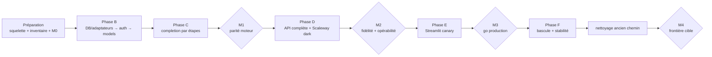

# Plan de migration — adaptateurs d'abord, extraction par slices

> Référence : [décisions de migration D7 à D10, D12 et D14](06-decisions.md). Avancement tenu au [LEDGER.md](LEDGER.md).

## Règles de livraison

- PRs additives vers `dev`. Le runtime historique reste servi ; l'API est construite et déployée à côté, puis Streamlit bascule sous feature flag.
- Extraire les règles derrière des ports, sans déplacer les fonctions couplées telles quelles ni améliorer la qualité au passage. Les tests historiques restent verts, les nouveaux s'ajoutent.
- Frontières d'import du core actives dès le squelette. L'interdiction DB/pipeline dans Streamlit attend le retrait du rollback, après stabilité en production.
- Migrations versionnées, idempotentes et testées sur DB locale synthétique avant staging.

Les changements comportementaux de l'ancien runtime sont reportés et suivis au [LEDGER](LEDGER.md), avec commit source et preuve de parité. Les correctifs urgents restent possibles ; pendant les cinq jours ouvrés avant M3, les changements qualité attendent ou imposent de rejouer les preuves.

## Préparation — phases 0 et A

Ces livrables peuvent être regroupés dans les premières PRs, pas une PR obligatoire par ligne. L'inventaire et les fixtures sont complétés module par module avant extraction. Le spike client et les arbitrages produit peuvent avancer en parallèle des adaptateurs, aux échéances indiquées.

| Repère | Livrable | Échéance |
|---|---|---|
| **A1** | ✅ Ancien pipeline TypeScript et références mortes supprimés ([#440](https://github.com/DGAFP/assistant-rh/issues/440)) | Terminé le 2026-09-01 |
| **A4 / A6** | Squelette `apps/api`, packaging, `/healthz`, `docker/api/Dockerfile`, gardes d'import et DB runtime synthétique | Avec les premières PRs DB B1/B2 |
| **A5** | ✅ [Inventaire initial I/O, état mutable et consommateurs](07-runtime-isolation-audit.md) ; compléter pour chaque module | Initial terminé le 2026-09-02 ; re-audit bloquant avant l'extraction concernée |
| **M0a / M0b** | Baseline goldset live et fixtures/replays exacts, config/corpus identifiés, résultats consignés | Avant l'extraction métier |
| **A2** | Essai du contrat avec SDK OpenAI et `conversations`, en local/homelab : messages, auth, erreurs et SSE | Avant le handler completion C1 |
| **A3** | Arbitrages de la [matrice Streamlit](#matrice-de-parité-streamlit) et liste des endpoints à conserver | Avant les endpoints admin concernés, puis la bascule |

Le proxy Scaleway reste testé au premier déploiement dark D4 ; aucun environnement cloud supplémentaire n'est créé pendant la préparation.

## Phase B — DB, adaptateurs, auth puis modèles

Cette phase construit les bords de l'hexagone avant d'extraire le pipeline. Les adaptateurs sont testés avec des contrats indépendants ; ils ne dépendent pas encore d'une copie du moteur historique.

| PR | Contenu | Preuve minimale |
|---|---|---|
| **B1** | Types partagés minimaux et ports dans `core/`, puis fondation DB : DSN/pool, transactions, révisions/cache et erreurs traduites | Import-linter + tests DB synthétique |
| **B2** | Adaptateurs DB : groupes/rôles/tokens, config, prompts, acronymes, search, documents/sections, chat runs/traces et feedback | Tests contractuels repository par repository |
| **B3** | Adaptateurs providers : Albert/Scaleway LLM et embeddings, reranker, timeouts/fallbacks ; aucun état `last_*` | Fakes HTTP + tests fallback/concurrence |
| **B4** | **Première slice : auth**. Bearer → groupe pour toutes les routes ; rôle `is_admin` pour `/admin/*` ; bootstrap/rotation du premier token admin | Isolation groupes/ministères, rotation et bootstrap testés |
| **B5** | **Deuxième slice : `GET /v1/models`** sur l'auth et le repository groupes déjà construits | Tests SDK OpenAI + filtrage/fallback ministère |

## Phase C — completion, extraite étape par étape

La DB et les providers existent déjà. Le handler de transport est posé avant l'extraction métier, puis chaque étape remplace une dépendance fake/replay par une règle pure nouvelle. L'ancien package n'est jamais modifié en façade et reste le runtime servi.

**Gate A5 obligatoire** : avant chaque extraction C2 à C7, appliquer la [règle de re-audit](07-runtime-isolation-audit.md#règle-bloquante-avant-une-extraction-de-phase-c). La PR doit mettre à jour la carte du module, assigner les nouveaux écarts dans le LEDGER et figer les règles d'ordre touchées.

| PR | Contenu | Preuve minimale |
|---|---|---|
| **C1** | Handler non-stream `/v1/chat/completions` branché sur un `ChatService` fake/replay : validation messages, historique 5 tours, modèle, erreurs et enveloppe sources | Tests de contrat HTTP sans moteur réel |
| **C2** | Extraction du query processor : intent, acronymes, reformulation et legal-search ; prompts/acronymes/LLM derrière ports | Conformance exacte sur fixtures M0b |
| **C3** | Extraction du retrieval : recherche brute via adaptateurs B2, fusion, scores, gates et déterminisme dans le core | Conformance d'étape + tests d'égalité de scores |
| **C4** | Extraction du section aggregator et du context builder : accès sections/documents/références via `ContentStorePort` | Conformance agrégation/contexte |
| **C5** | Extraction du context selector, de la composition du prompt ministère et du generator | Replays + anti-hallucination/no-answer/fallback |
| **C6** | `Pipeline`/`ChatService` réel, `RunContext` par requête, logging/tracing via ports et persistance non-stream | Conformance bout en bout + tests de concurrence |
| **C7** | Streaming SSE : worker borné, file async, pings, erreur post-headers, annulation et persistance avant `[DONE]` | Tests stream/déconnexion/erreur sur local et homelab |

**Jalon M1 — parité moteur** :

- ancien runtime → nouveau core : sorties d'étapes et résultat structuré exacts sur M0b ;
- goldset live apparié : aucune régression au-delà des tolérances M0a ;
- deux requêtes simultanées de ministères différents ne partagent ni prompt, ni résultat, ni trace.

## Phase D — fonctions API restantes et déploiement dark

| PR / étape | Contenu |
|---|---|
| **D1** | `POST /v1/feedback` avec ownership groupe/run, raisons structurées, enrichissement goldset et analyse durable |
| **D2** | Endpoints admin retenus en A3 : config/prompts/acronymes, groupes/rôles/tokens, chat-runs/traces, feedback/stats/analyse et endpoints documentaires étroits |
| **D3** | Runner via-API : conformance exacte en replay et goldset live séparé ; tests SDK OpenAI/`conversations` conservés |
| **D4** | Déployer le container complet sur Scaleway staging en mode dark. Valider pour la première fois le proxy réel : cold start, pings/buffering SSE, timeout, mémoire, déconnexion et observabilité |

**Jalon M2 — fidélité API et opérabilité** : conformance core ↔ API exacte en replay, qualité live dans les tolérances M1, intégration `conversations`, streaming Scaleway et métriques opérationnelles au vert.

## Phase E — Streamlit et canary staging

| PR / étape | Contenu |
|---|---|
| **E1** | Client Chat Completions SSE et provisioning serveur des bearers ; `RAG_CHAT_BACKEND=direct\|api`, défaut `direct` |
| **E2** | Clients admin HTTP selon A3 ; accès DB existant conservé seulement dans le mode de rollback |
| **E3** | Activer `api` pour un canary staging borné ; comparer qualité, satisfaction, erreurs, latence et complétude des logs |
| **E4** | Fenêtre de stabilité staging de 5 jours ouvrés minimum ; exercices `api → direct` et rotation de tokens |

**Jalon M3 — autorisation de bascule production** : M2 toujours vert, canary sans régression inexpliquée, fonctions admin retenues disponibles, rollback testé et dette LEDGER à zéro.

## Phase F — production, stabilité puis nettoyage

| Étape | Contenu |
|---|---|
| **F1** | Promouvoir API + Streamlit dual-path en production avec `direct` encore actif ; smoke API dark |
| **F2** | Activer `RAG_CHAT_BACKEND=api` par configuration ; conserver `direct` pendant la fenêtre de stabilité convenue |
| **F3** | Après validation explicite : supprimer `packages/rag-pipeline`, le chemin direct, les accès DB Streamlit, fallbacks obsolètes et flags de rollback |
| **F4** | Activer la garde finale interdisant DB/pipeline dans Streamlit ; balayer apps, packages, `src`, tests, scripts, docs et workflows |
| **M4 — cible atteinte** | Conformance + goldset final, admin smoke, frontières CI et déploiement standard verts ; journal + LEDGER consignés |

## Matrice de parité Streamlit

| Page/fonction | Cible proposée | Décision requise avant |
|---|---|---|
| `01_Chatbot` | Client Chat Completions SSE sous feature flag, ancien chemin en rollback | E1 |
| `02_Chat_Logs` | `/admin/chat-runs` liste/détail | PR D2 |
| `03_Feedback_Dashboard` | `/admin/feedback`, stats, analyse et exports reconstruits côté client | PR D2 |
| `04_Admin_Config` | RAG config + CRUD prompts + CRUD acronymes + health via API | PR D2 |
| `05_DB_Explorer` | Endpoint document/chunk étroit, maintien temporaire ou archivage approuvé — jamais SQL générique | A3 |
| `06_Goldset_Explorer` | API goldset dédiée, outil séparé ou maintien temporaire | A3 |
| `08`, `09`, `10` évals | CLI/outils dédiés, maintien temporaire ou archivage approuvé | A3 |
| `12_Pipeline_Timeline` | Détail run + `/trace` | PR D2 |
| `13_admin` | Redirection vers la page admin cible | PR D2 |
| `14_User_Groups` | CRUD, reset password, suppression protégée, rôles et rotation bearer | PR D2 |
| `15_Import_Sources` | Inchangé (Grist + S3), hors frontière DB RAG | — |
| `_PDF_Viewer` | Endpoint document/PDF étroit ou URL signée ; sinon retrait approuvé | A3 |

## Après le chantier

- Temps 2 : fork `conversations` complet avec ProConnect et feedback ; le spike A2 réduit le risque technique mais ne remplace pas la décision DINUM/DGAFP.
- Suppression du chat Streamlit ; Streamlit devient admin pur.
- Extraction éventuelle de `assistant_rh_api.core` en package uniquement si un consommateur et un cycle de release indépendants apparaissent.
- Améliorations pipeline consignées au LEDGER pendant l'extraction.

## Récapitulatif

## Mapping existant → cible

Chaque ligne décrit une **extraction de comportement** derrière des ports, validée par les tests de parité. Les fonctions couplées ne sont pas déplacées telles quelles ; l'ancien chemin reste disponible jusqu'à la fin de la bascule.

| Aujourd'hui | Cible | Travail |
|---|---|---|
| `packages/rag-pipeline/.../pipeline.py` | `assistant_rh_api/core/pipeline/orchestration.py` + `RunContext` + `ChatRunStorePort` | extraire l'orchestration, sans état `last_*` |
| `.../retriever.py` | logique de fusion/gates → `core/pipeline/steps/retrieval.py` ; SQL → `db/search.py` | caractériser puis réimplémenter séparément |
| `.../query_processor.py` | règles → `core/pipeline/steps/query_processor.py` ; prompts/acronymes/LLM → ports | extraction comportementale |
| `.../context_builder.py` | budget/triangulation → core ; documents/références SQL → `ContentStorePort` | extraction comportementale |
| `.../section_aggregator.py` | agrégation/ranking → core ; chargement sections → `ContentStorePort` | extraction comportementale |
| `.../context_selector.py`, `generator.py` | décisions → core ; prompts/LLM → ports injectés | extraction comportementale |
| `.../reranker.py`, `llm_client.py`, `embedder.py` | `gateways/` ; seuils/gates dans le core | adaptateurs puis extraction des règles |
| `.../chat_logger.py`, `tracing.py` | `db/chat_run_store.py` derrière `ChatRunStorePort` | adaptateur DB |
| `.../admin.py` | adaptateurs/services admin + schéma dans `core/config.py` | séparer I/O et validation |
| `.../models.py`, `config.py`, `ministry_scope.py` | `core/` sans re-export ni initialisation I/O | extraction légère |
| `.../citation_extractor.py`, `conformance.py`, `db_helpers.py` | core pour les règles ; `db/` pour les helpers SQL | séparation |
| `.../feedback_analyzer.py` | service applicatif + `FeedbackStorePort` | séparation |
| `src/ui/user_groups_store.py`, `groups.py` | `db/user_groups.py`, auth handler et scope dans `core/chat_service.py` | première slice verticale |
| `src/ui/chatbot_*`, `citation_deduplicator.py`, `db_utils.py`, `llm_selector.py` | conservés pour le rollback, puis absorbés ou supprimés | nettoyage tardif |
| `src/ui/source_import.py`, `private_datasets.py` | **inchangés** (Grist + S3) | hors chantier RAG |
| `src/goldset/` | imports vers `assistant_rh_api.core` + adaptateurs d'éval | repointage après parité |
| Ancien pipeline TypeScript | supprimé par A1 ([#440](https://github.com/DGAFP/assistant-rh/issues/440)) | terminé |

## Audit d'isolation A5

L'[audit A5](07-runtime-isolation-audit.md) couvre les 21 modules Python, les prompts embarqués et les consommateurs directs. Il est complété avant l'extraction de chaque module :

- SQL et résolution de DSN ;
- prompts/config/acronymes dynamiques ;
- appels LLM, embeddings, reranker et observabilité ;
- caches, pools, horloges et génération d'identifiants ;
- état mutable `last_*`, diagnostics et données nécessaires au logging ;
- consommateurs dans les apps, `src/`, tests, scripts et workflows.

Chaque dépendance devient une donnée pure, un port, un adaptateur ou un élément du `RunContext`. Le [LEDGER](LEDGER.md#écarts-disolation-a5) consigne les écarts découverts avec propriétaire et statut.

Exemple retrieval : `db/search.py` retourne des chunks scorés bruts ; `core/pipeline/steps/retrieval.py` porte fusion, normalisation, seuils et déduplication. Les tests caractérisent ce comportement avant extraction.
