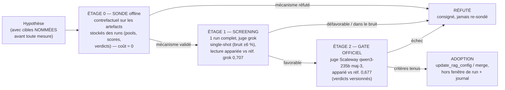

# Revue des expérimentations qualité — campagne de sondes des 23-24/07/2026

Ce document consigne la campagne d'expérimentations menée après l'adoption du
paquet vague 1 (P1 + R2, gate run 156) : la **méthodologie** de validation
d'hypothèses, **toutes les hypothèses testées** avec leurs résultats chiffrés,
et les **choix finaux**. Il complète la stratégie
([revue-strategies-qualite-rag.md](revue-strategies-qualite-rag.md)) et le
journal des runs ([journal-experimentations-rag.md](journal-experimentations-rag.md)).

Règle d'or de la campagne : **aucune hypothèse n'est adoptée ni écartée sans
mesure** — et chaque réfutation est consignée ici pour ne jamais être re-sondée
par accident.

---

## 1. Méthodologie — l'échelle sonde → screening → gate

- **Étage 0 — la sonde** : rejouer le mécanisme sur les données réelles
  stockées (pools de retrieval, scores, sections servies des runs 156/161),
  avec le vrai reranker/selector/embedder quand il le faut, mais **sans
  jamais relancer une éval**. Une sonde valide un *mécanisme* (containment,
  classement, sélection) — jamais une *conversion* au juge. Chaque sonde
  s'auto-valide : le rejeu de la baseline doit reproduire le comportement réel
  stocké (fidélité mesurée), sinon la sonde est jetée.
- **Étage 1 — le screening** : un run complet à moindre coût (juge grok
  single-shot, zéro-rétention). Lecture **appariée** contre la référence grok
  des runs 118/123/124 (0,707 ; 16 échecs stables-grok) — jamais contre la
  référence officielle (juges non comparables).
- **Étage 2 — le gate** : réservé aux adoptions staging/prod. Juge souverain
  Scaleway maj-3 (bruit effectif ~0,8 %), lecture appariée contre la référence
  officielle 0,677 (verdicts versionnés dans `verdicts-officiels/`), critères
  de succès sur cibles nommées + non-régression + latence.

Invariants de discipline : cibles et contrôles nommés **avant** le run ;
verdicts appariés uniquement (le global masque tout) ; config partagée jamais
mutée pendant un run ; goldset gelé pendant les runs ; un run lancé = une
entrée au journal.

**Mise à jour du protocole (24/07) — ablation stricte** : un changement par
screening, jamais de paquet groupé au screening (décision utilisateur : le gate
groupé P1+R2 a laissé des ambiguïtés d'attribution que les sondes ont dû
démêler après coup). Les overrides CLI d'ablation de l'éval
(`--system-prompt-name`, `--rerank-input-k`, `--min-kept-sections`…) rendent
chaque screening isolable sans mutation de la config partagée. Le gate maj-3
officiel peut ensuite couvrir l'ensemble des changements screenés.

---

## 2. Hypothèses testées et résultats

### 2.1 Vue d'ensemble

| # | Hypothèse | Sonde (étage 0) | Screening (étage 1) | Gate (étage 2) | Verdict |
|---|---|---|---|---|---|
| H1 | `rerank_input_k` 20→40 (P1) | ✅ contrefactuel 17/07 (q17, q192 rangs 1-4 en full-pool) | ✅ run 145 (q17 convertie) | ✅ run 156 | **ADOPTÉ** (config 23/07 16:10) |
| H2 | R2 résumés d'articles (lignes additives) | ✅ pilote 101/101 + corpus 4 201/4 207 | — (économie : gate direct) | ✅ run 156 (q30, q217 converties) | **ADOPTÉ** (4 203 lignes staging) |
| H3 | Gate d'abstention `score < 0,20` (+ `min_kept` couplé) | ❌ balayage post-adoption : à TOUT seuil, plus de passers cassés que d'abstentions correctes (0,20 : 1 correcte / 2 cassés dont q217 fraîchement convertie) | — | — | **RÉFUTÉ** (la vague 1 a vidé son gisement : méd. max-score des FAIL = 0,973 = celle des PASS) |
| H4 | Texte de rerank = heading + best-chunk (vs `markdown[:1500]`) | ❌ v2/v3 : +1/-1 containment (gagne q183, perd q4531), hybride pire ; 10/16 échecs ont le gold hors pool (hors de portée) | — | — | **RÉFUTÉ** (q30, son cas d'école, avait déjà converti) |
| H5 | Renvois juridiques (expansion 1 saut) | ❌ 1 seule cible atteignable depuis le servi (q192) ; q191, cible historique, inatteignable | — | — | **RÉFUTÉ comme levier de conversion** (valeur anti-hallucination réelle mais rendement ~0 après H9) |
| H6 | Budget du context_builder trié par score | ❌ zéro échec ne meurt au budget — le selector (2-3 gardées / 20) est le goulot | — | — | **RÉFUTÉ / réorienté vers le selector** |
| H7 | Meilleur embedder (bge-multilingual-gemma2 3584d vs m3 1024d) | ❌ pire sur 4/6 golds ratés ; les golds « ratés » sont déjà aux rangs sémantiques 1-18 sous m3 | — | — | **RÉFUTÉ** (le problème n'est pas l'embedding) |
| H8 | Repondération du score d'agrégation (biais anti-article) | ❌ même la variante agressive ne sauve pas q192 et déplace 14-20 % des sections servies | — | — | **RÉFUTÉ** (biais réel et expliqué, mais remède dominé par H9/H11) |
| H9 | `rerank_input_k` 40→64 | ✅ contrefactuel : q16/q191/q192 servis (rangs 15/6/4), contrôles stables ; full-goldset : +2 gains / −2 passers limites | ⚠️ run 161 : global +1 pt, net stables-grok −2 (dans le bruit), q192 convertie, latence améliorée | — | **VALIDÉ en containment, NON ADOPTÉ** — supplanté par H11 (préférence first-principles) |
| H10 | 2 pipelines (dgafp vs reste) + RRF | ⚠️ 2/3 cibles (q192 rang 3, q191 rang 5 ; q16 ratée — compétition interne SP) | — | — | Partiel → généralisé en H11 |
| H11 | **3 pipelines** (dgafp / SP / ministériel, quotas 20/20/20) | ✅ mini-panel 3/3 (q16 rang 12, q191 rang 6, q192 rang 4) ; full-goldset 99 q : mêmes gains/pertes que H9 mais churn moindre (0,90 vs 0,86) | à venir (paquet) | à venir | **DESIGN CIBLE retenu** |
| H12 | Hybride lexical (RRF sémantique+tsvector par pipeline) | ❌ zéro gain (le lexical ne retrouve pas non plus les golds hors pool) | — | — | **RÉFUTÉ** (2ᵉ réfutation de l'hybride, après celle du 17/07) |
| H13 | Selector prompt v2 (PR #306 : dé-parcimonie, anti-redondance) | ⚠️ rejeu LLM réel : améliore les contrôles (q1, q7 : gold pris 2/2 vs 0-1/2) mais **ne convertit aucune cible** (q174/q183/q191/q4531 toujours jetées, même au rang 3) ; garde 1-6 sections au lieu des « 4-10 » demandées | à venir (paquet) | à venir | **PARTIEL** — à compléter par une garantie mécanique « union top-K » (un plancher par prompt ne se fait pas obéir) |
| H14 | Curation goldset (golds « morts ») | ✅ ids = ancien schéma uuid5 pré-#289, jamais valides ; **re-résolution par libellés : 7/9 réparées** (backup 24/07) | n/a | n/a | **FAIT** — 2 restantes à re-sourcer (q203 : article abrogé ; q4535 : réf. « A5 ») |

Réfutations antérieures rappelées (ne pas re-sonder — détail dans la revue
stratégies) : multi-query, RRF pondéré multi-requêtes, hybrid ancien pipeline,
hausse de `top_k`, plancher fixe 0,7 (17/07) ; RAG agentique multi-turn et
génération multi-turn auto-vérifiée (NO-GO mesurés, complaisance
d'auto-vérification).

### 2.2 Les trois découvertes structurantes de la campagne

1. **Le biais anti-article du score d'agrégation** (H8/H9/H11) :
   `agg = 0,5×max + 0,3×mean + 0,2×(n_chunks/max_chunks)` — un article
   juridique (1 chunk, max=1 mesuré) plafonne son terme de comptage face aux
   sections PDF (jusqu'à 30 chunks). Des golds aux rangs sémantiques **1-2**
   se retrouvent aux positions 41-61, hors des 40 candidats du reranker.
   Historiquement daté : les poids ont été réglés quand dgafp était derrière le
   gate `needs_legal` (commit `49ec508` = passage en always-on). Les scores
   n'étant **pas calibrés entre corpus**, la solution de fond est de ne plus
   les faire concourir (H11), pas de retoucher les poids (H8 réfutée).
2. **Le selector est le goulot aval** (H6/H13) : il garde 2-3 sections sur 20
   et jette des golds servis aux rangs 3-15. Un prompt ne suffit pas (H13) —
   il faut une garantie mécanique (union des choix du selector et du top-K du
   reranker).
3. **L'instrument compte autant que le pipeline** (H14) : un tiers des échecs
   résiduels étaient immesurables pour cause d'annotations mortes. La
   curation a réattribué 4 questions et renforcé le dossier des leviers
   restants.

### 2.3 Détail par hypothèse — pourquoi (rationnel) et comment (méthode)

#### H1 — `rerank_input_k` 20→40

- **Pourquoi** : l'autopsie du funnel (17/07) a montré que le pré-filtre en dur
  à 20 candidats coupait la section-réponse de 3 échecs mesurés (q17, q192,
  q218) **avant** que le reranker ne puisse la voir — alors que le
  contrefactuel full-pool prouvait que le reranker, lui, la classait 1ᵉʳ-4ᵉ
  (q17 : scores 0,9996+ ; q192 : rang 1). Le coupable était la plomberie, pas
  le modèle.
- **Comment** : sonde = rejeu du vrai reranker Albert sur les pools complets
  (validation du mécanisme) ; #335 a livré la clé `v3_rerank_input_k`
  découplée de la sortie, avec une probe live 40 docs / 73 k chars en une
  requête ; screening run 145 (grok, apparié réf. grok) ; gate run 156.

#### H2 — R2, résumés d'articles en langage métier

- **Pourquoi** : le fossé lexical questions RH ↔ texte juridique est LE motif
  d'échec du corpus dgafp (campagne Suivi-Tests, thème `typologie_contrats` à
  48 % de feedbacks négatifs) : les articles existent en base mais leurs
  embeddings ne matchent pas les formulations métier.
- **Comment** : principe structurel « le résumé TROUVE, il ne DIT jamais »
  (embedding = résumé métier, `chunk_text` servi = texte juridique authentique,
  ligne additive `{cid}_r2s` fusionnée à l'agrégation) ; pilote 101 articles
  générés **à l'aveugle des questions** avec garde anti-invention (rejet si
  valeur chiffrée absente de la source) et rang simulé par insertion de
  similarité ; corpus complet 4 201/4 207 (rejets 0,14 %) ; inspection humaine
  15 paires ; apply gaté ; gate run 156.

#### H3 — Gate mécanique d'abstention (seuil 0,20)

- **Pourquoi** : le 17/07, les scores du reranker séparaient nettement les
  pools vides (méd. ~0,20) des pools sains (~0,97) — un seuil bas devait
  convertir « générer sur du bruit » en « introuvable » honnête
  (anti-hallucination), à coût quasi nul (6/12 pools pauvres abstenus pour
  1 passer cassé).
- **Comment** : balayage de seuils t ∈ {0,15…0,60} sur les scores post-rerank
  RÉELS du run 156 (97 questions exploitables), croisés avec les verdicts —
  pour chaque t : abstentions correctes (FAIL sous le seuil) vs passers cassés
  (PASS sous le seuil).
- **Pourquoi c'est tombé** : la vague 1 a réparé les pools vides — la médiane
  des max-scores des ÉCHECS est montée à 0,973, identique à celle des passers.
  Le signal bimodal qui justifiait le seuil n'existe plus ; à tout seuil le
  troc est défavorable (0,20 : 1 correcte / 2 cassés, dont q217 fraîchement
  convertie par R2). Leçon : re-mesurer les distributions après chaque
  adoption — un levier validé sur l'ancienne distribution peut être réfuté par
  la nouvelle.

#### H4 — Texte de rerank (heading + best-chunk)

- **Pourquoi** : le reranker juge chaque section sur `# heading +
  markdown[:1500]` — pour les longues sections PDF, la réponse vit souvent
  au-delà des 1 500 premiers caractères ; les revues de code attribuaient à
  cette troncature les rangs 9-13 de q30.
- **Comment** : reconstruction fidèle des sections candidates depuis les
  artefacts du run 156 (fusion des paires `_0`/`_r2s` comme l'aggregator,
  `section_markdown` relu en base, standalone = premier chunk), **fidélité de
  replay auto-mesurée (méd. 0,91)** — la v1 de la sonde, infidèle (0,25-0,5),
  a été jetée ; puis rejeu du vrai reranker sur 3 variantes de texte
  (baseline / best-chunk / hybride), 18 échecs stables + 10 passers, golds
  localisés via `gold_doc_ids`.
- **Pourquoi c'est tombé** : troc +1/-1 (q183 entre dans le servi, q4531 en
  sort), l'hybride protège les passers mais perd le gain ; et surtout 10/16
  échecs ont leur gold **hors du pool de 40** — aucun texte de rerank ne peut
  classer une section absente.

#### H5 — Graphe de renvois juridiques (1 saut)

- **Pourquoi** : les réponses paraphrasent de mémoire les articles cités mais
  non servis (« l'article L. 332-4 prévoit… ») — servir le texte cité devait
  à la fois convertir (cible historique q191) et réduire l'hallucination.
- **Comment** : parsing des `lien_citations` (JSON Légifrance, `articleId` de
  type CITATION) des articles servis et du top-20 du run 156 ; mesure
  d'atteignabilité du gold à 1 saut + coût d'expansion (articles ajoutés).
- **Pourquoi c'est tombé** : depuis le servi, seule q192 est atteignable — et
  H9/H11 la récupèrent déjà par le classement. q191 n'est PAS à 1 saut de ce
  qui est servi. Rendement de conversion ≈ 0 ; la valeur anti-hallucination
  reste réelle mais n'est plus prioritaire.

#### H6 — Budget du context_builder trié par score

- **Pourquoi** : le cas q28 (17/07) documentait une 2ᵉ section-réponse jetée
  par le budget de tokens pendant que du bruit passait.
- **Comment** : attribution funnel sur le run 156 — pour chaque échec, à quel
  étage meurt le gold (pool 40 → top-20 → servi final), via `chunks_raw`,
  `chunks_after_rerank`, `sources`/`context_items_ref`.
- **Pourquoi c'est tombé** : zéro échec ne meurt au budget. La coupe fatale
  est le **selector** (garde 2-3 sections sur 20). q28 avait déjà converti.
  Le levier est réorienté : plancher mécanique de sélection, pas tri de budget.

#### H7 — Meilleur modèle d'embedding

- **Pourquoi** : intuition naturelle (« le retrieval rate → un modèle plus
  gros trouverait ») ; `embedding_bge_scw` (bge-multilingual-gemma2, 3 584 d)
  était déjà peuplé sur 100 % du corpus — comparaison gratuite.
- **Comment** : rang sémantique de chaque gold raté sous m3 ET sous bge, avec
  les requêtes réelles du run 156 (embedder de requête de chaque modèle),
  contrôles passers.
- **Pourquoi c'est tombé** : bge est PIRE sur 4/6 golds (q192 : rang 2 → 65).
  Et le diagnostic s'inverse : les golds « ratés » sont déjà aux rangs 1-18
  sous m3 — l'embedding les trouve, c'est l'aval (agrégation, selector) qui
  les perd. Les 2 vrais fossés (q181, q213) le restent sous les deux modèles.

#### H8 — Repondération du score d'agrégation

- **Pourquoi** : découverte du biais anti-article — `agg = 0,5×max + 0,3×mean
  + 0,2×(n/max_n)` : un article = 1 chunk (max mesuré = 1 après fusion R2),
  une section PDF = jusqu'à 30 → le terme de comptage vaut jusqu'à 0,2 (≈ 2
  crans de similarité) contre l'article. Des golds rangs sémantiques 2 finissent
  positions 41-61. Biais historiquement daté : poids réglés quand dgafp était
  derrière le gate `needs_legal` (passage en always-on : commit `49ec508`).
- **Comment** : recalcul offline de l'ordre d'agrégation (97 questions,
  fidélité V0 = 1,00) sous 4 jeux de poids (baseline / count réduit / sans
  count / count plafonné), métriques : positions des golds cibles + fraction
  des sections réellement servies restant candidates.
- **Pourquoi c'est tombé** : même sans terme de comptage, q192 reste position
  50 (les similarités inter-tables ne sont pas calibrées — le vrai problème
  est la compétition inter-corpus, pas les poids) ; et les variantes déplacent
  14-20 % des sections servies (risque passers). Remède dominé par H11.

#### H9 — `rerank_input_k` 40→64

- **Pourquoi** : l'investigation « hors pool » a montré que les golds de q16,
  q191, q192 étaient RETROUVÉS par le retrieval mais relégués aux positions
  41-61 par le score d'agrégation — juste derrière la coupe des 40 candidats
  (q191 : à UNE place).
- **Comment** : contrefactuel avec le vrai reranker en batching de prod
  (40+24) : mêmes pools, 40 vs 64 candidats, 3 cibles + 6 contrôles ; puis
  full-goldset (99 questions) ; screening run 161 (grok, apparié).
- **Résultat** : sonde 3/3 (rangs 15/6/4, contrôles stables) ; full-goldset
  +2 gains / −2 passers limites (q185, q186 — délogés par la COMPÉTITION du
  pool élargi, pas par le mécanisme) ; screening : global +1 pt, net
  stables-grok −2 (bruit), q192 convertie, q16/q191 toujours bloquées par le
  selector, latence p95 améliorée. Verdict : levier réel mais plafonné par le
  selector, et contournement dominé par H11 — non adopté.

#### H10 / H11 — Pipelines par corpus (2 puis 3)

- **Pourquoi** : H7/H8 ont établi que les scores de similarité ne sont **pas
  comparables entre corpus** (q192 : rang 2 dans dgafp, ~50ᵉ du pool mélangé).
  Idée (utilisateur) : classer chaque corpus chez lui, donner un quota de
  candidats à chacun, laisser le reranker — qui juge le TEXTE — arbitrer.
  First principles : supprime la cause (compétition non calibrée) au lieu de
  la contourner (H9), quotas explicites et auditables, robuste à l'arrivée de
  nouveaux corpus (R2 phase 2).
- **Comment** : candidats reconstruits par corpus depuis les pools du run 156
  (dgafp = clés cid, SP = standalone, ministériel = sections uuid) ; H10 :
  fusion 2 listes (RRF interleave et quota fixe 26+14) ; H11 : top-20 par
  corpus → 60 candidats → vrai reranker ; mini-panel (5 cibles + 5 contrôles)
  puis full-goldset 99 questions (gains/pertes gold servi, churn du top-20,
  mix corpus).
- **Résultat** : H10 = 2/3 (q16 reste victime de la compétition interne SP) ;
  H11 = **3/3** (12/6/4), full-goldset : gains/pertes identiques à H9
  (+q191/q192, −q185/q186) mais churn moindre (méd. 0,90 vs 0,86) et mix servi
  équilibré (6/8/6). La perte q185/q186 est intrinsèque à TOUT élargissement
  (leurs golds restent candidats ; c'est le reranker qui préfère les nouveaux
  arrivants). Retenu comme design cible.

#### H12 — Hybride lexical par pipeline

- **Pourquoi** : dernier espoir pour les fossés d'embedding (q181, q213) — si
  la sémantique ne fait pas le pont, peut-être que les tokens le font
  (tsvector/BM25 français, colonnes `*_tsv` déjà en place partout).
- **Comment** : par pipeline, RRF(classement sémantique stocké, classement
  lexical live `websearch_to_tsquery`) → top-20 par corpus → vrai reranker ;
  mêmes cibles et contrôles que H11.
- **Pourquoi c'est tombé** : zéro gain — et le point décisif : le lexical ne
  retrouve **pas non plus** les golds hors pool dans son propre top-30
  (« accident de service / rémunération » vs « congé / plein traitement » :
  vocabulaires disjoints des deux côtés). 2ᵉ réfutation de l'hybride, cette
  fois dans l'architecture cible. Par élimination, q181/q213 relèvent de la
  QUALITÉ des résumés R2 (itération de prompt), pas de la plomberie.

#### H13 — Selector prompt v2 (PR #306)

- **Pourquoi** : H6 a désigné le selector comme goulot (2-3 gardées sur 20,
  golds servis aux rangs 3-15 jetés) ; la PR #306, dormante depuis le 10/07,
  portait déjà le remède supposé : dé-parcimonie (« 4-10 sections, écarter la
  bonne source est l'erreur la plus coûteuse »), anti-redondance corrigée
  (garder la version ministérielle ET la générale), périmètre FPE.
- **Comment** : rejeu de l'appel LLM réel du selector (openweight-large,
  temp 0) sur les 20 sections servies STOCKÉES des runs 156/161, prompt v1
  (ligne DB active) vs v2 (fichier PR), 2 répétitions par prompt (variance),
  5 cas cibles + 3 contrôles.
- **Résultat** : v2 améliore les contrôles (q7 : gold pris 2/2 contre 0/2) et
  élargit un peu (1-6 sections vs 1-3)… mais **ne convertit aucune cible** —
  le LLM continue de jeter les articles gold même au rang 3, et n'atteint
  jamais les « 4-10 sections » demandées. Leçon : un plancher porté par le
  prompt ne se fait pas obéir ; la garantie doit être mécanique (servir
  l'union {choix du selector} ∪ {top-K du reranker}). Le prompt v2 reste utile
  et sera screené SEUL (protocole d'ablation), la garantie mécanique
  séparément.

#### H14 — Curation goldset

- **Pourquoi** : 8 des 18 échecs stables étaient immesurables — leurs
  `gold_doc_ids` (UUID v5) n'existaient nulle part en base, et une recherche
  dans TOUT l'historique des runs a prouvé qu'ils n'avaient JAMAIS été
  valides : ids de l'ancien schéma de dérivation pré-#289.
- **Comment** : pas d'archéologie d'uuid — **re-résolution depuis les libellés
  humains** (« Decret 86-83, Article 13 » → requête number+full_title dgafp ;
  fiches SP par short_id), vérification d'existence + embeddings, backup des
  valeurs remplacées, UPDATE `text[]` hors fenêtre de run.
- **Résultat** : 7/9 réparées automatiquement ; q203 (article 3 du 86-83
  abrogé — la réponse vit désormais dans le CGFP) et q4535 (réf. « A5 »
  introuvable) à re-sourcer manuellement. Effet immédiat : 4 questions
  réattribuées dans le funnel (2 génération, 1 selector, 1 coupe-candidats) —
  la curation a RENFORCÉ le dossier des leviers restants.

---

## 3. Le funnel final des 18 échecs stables (post-curation, run 156)

| Étage de mort du gold | Questions | n | Levier |
|---|---|---|---|
| Génération (gold servi, échec) | q11, q676, q205, q210 | 4 | Programme B (#303) |
| Selector (top-20, jeté) | q174, q183, q4531, q211 | 4 | union top-K + prompt v2 (#306/#299) |
| Coupe des 40 candidats (retrouvé, positions 41-61) | q16, q191, q192, q222 | 4 | 3-pipelines (H11) |
| Hors pool (fossé sémantique ET lexical) | q181, q213, q216, q221 | 4 | itération R2-prompt v2 (résumés plus situationnels) |
| Goldset à re-sourcer | q203 (article abrogé), q4535 (« A5 ») | 2 | curation manuelle (#338) |

Lecture d'ensemble : le gisement « plomberie retrieval » restant vaut ~8
questions au mieux (selector + coupe candidats) ; le reste vit dans la
génération, la qualité des résumés et l'instrument. **La trajectoire 0,85-0,90
passe par les programmes B et C**, pas par de nouveaux micro-leviers retrieval
— conclusion conforme à la revue stratégies.

---

## 4. Choix finaux

1. **Adopté** (gate run 156, 23/07) : `v3_rerank_input_k=40` + 4 203 lignes R2
   en staging. Global 0,677 = référence, net stables +3, latence améliorée,
   rollback disponible (1 DELETE + clé à 40→20).
2. **Design cible retenu : architecture 3-pipelines** (quotas par corpus,
   fusion par le reranker sur le texte, pas de calibration inter-corpus) —
   choix first-principles confirmé par la mesure (churn moindre, robuste à la
   croissance des corpus de la phase 2). `input_k=64` reste une preuve de
   sonde, **non adopté** (contournement dominé par le design cible).
3. **Paquet de consolidation à venir** (dernier chantier plomberie) :
   3-pipelines + selector prompt v2 (#306) + union top-8 mécanique — UN
   screening grok, UN gate maj-3. Pas de gate si le screening est dans le
   bruit.
4. **Pivot d'effort acté** : Programme B (#303, 4 cibles génération nommées),
   Programme C (#338, goldset 300-500 depuis les feedbacks réels + fin de
   curation), R2 phase 2 (#337, dont l'architecture 3-pipelines est le
   prérequis sain), itération R2-prompt v2 (4 cibles hors-pool nommées).
5. **Réfutés — ne pas re-sonder sans fait nouveau** : H3, H4, H5, H6, H7, H8,
   H12 (et les réfutations du 17/07 rappelées en 2.1).

## Sources

- Runs : 156 (`gate_adoption_p1r2_20260723`), 161 (`candidate_input64_20260723`),
  145 (screening P1) — base staging `rag_quality_eval_runs/items`.
- Verdicts officiels versionnés : `docs/evals/verdicts-officiels/`.
- Artefacts de sondes (VM `dev@assistant-rh`, `~/assistant-rh/`) :
  `sonde_rerank_text_v2/v3.json`, `sonde_renvois_budget.json`,
  `invest_horspool.json`, `sonde_3pipes_full.json`, `sonde_input64_full.json`,
  `goldset_gold_doc_ids_backup_20260724.json`, logs `eval_gate.log`,
  `eval_i64.log`.
- PRs/issues : #332, #333, #334, #335, #336 (fermée), #343, #348, #306, #299,
  #244, #303, #337, #338.
