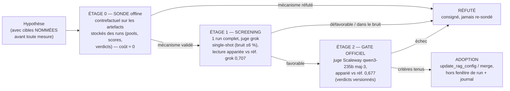

# Revue des expérimentations qualité — campagne de sondes des 23-24/07/2026

Ce document consigne la campagne d'expérimentations menée après l'adoption du
paquet vague 1 (P1 + R2, gate run 156) : la **méthodologie** de validation
d'hypothèses, **toutes les hypothèses testées** avec leurs résultats chiffrés,
et les **choix finaux**. Il complète la stratégie
([revue-strategies-qualite-rag.md](revue-strategies-qualite-rag.md)) et le
journal des runs ([journal-experimentations-rag.md](journal-experimentations-rag.md)).

Règle d'or de la campagne : **aucune hypothèse n'est adoptée ni écartée sans
mesure** — et chaque réfutation est consignée ici pour ne jamais être re-sondée
par accident.

---

## 1. Méthodologie — l'échelle sonde → screening → gate

- **Étage 0 — la sonde** : rejouer le mécanisme sur les données réelles
  stockées (pools de retrieval, scores, sections servies des runs 156/161),
  avec le vrai reranker/selector/embedder quand il le faut, mais **sans
  jamais relancer une éval**. Une sonde valide un *mécanisme* (containment,
  classement, sélection) — jamais une *conversion* au juge. Chaque sonde
  s'auto-valide : le rejeu de la baseline doit reproduire le comportement réel
  stocké (fidélité mesurée), sinon la sonde est jetée.
- **Étage 1 — le screening** : un run complet à moindre coût (juge grok
  single-shot, zéro-rétention). Lecture **appariée** contre la référence grok
  des runs 118/123/124 (0,707 ; 16 échecs stables-grok) — jamais contre la
  référence officielle (juges non comparables).
- **Étage 2 — le gate** : réservé aux adoptions staging/prod. Juge souverain
  Scaleway maj-3 (bruit effectif ~0,8 %), lecture appariée contre la référence
  officielle 0,677 (verdicts versionnés dans `verdicts-officiels/`), critères
  de succès sur cibles nommées + non-régression + latence.

Invariants de discipline : cibles et contrôles nommés **avant** le run ;
verdicts appariés uniquement (le global masque tout) ; config partagée jamais
mutée pendant un run ; goldset gelé pendant les runs ; un run lancé = une
entrée au journal.

---

## 2. Hypothèses testées et résultats

### 2.1 Vue d'ensemble

| # | Hypothèse | Sonde (étage 0) | Screening (étage 1) | Gate (étage 2) | Verdict |
|---|---|---|---|---|---|
| H1 | `rerank_input_k` 20→40 (P1) | ✅ contrefactuel 17/07 (q17, q192 rangs 1-4 en full-pool) | ✅ run 145 (q17 convertie) | ✅ run 156 | **ADOPTÉ** (config 23/07 16:10) |
| H2 | R2 résumés d'articles (lignes additives) | ✅ pilote 101/101 + corpus 4 201/4 207 | — (économie : gate direct) | ✅ run 156 (q30, q217 converties) | **ADOPTÉ** (4 203 lignes staging) |
| H3 | Gate d'abstention `score < 0,20` (+ `min_kept` couplé) | ❌ balayage post-adoption : à TOUT seuil, plus de passers cassés que d'abstentions correctes (0,20 : 1 correcte / 2 cassés dont q217 fraîchement convertie) | — | — | **RÉFUTÉ** (la vague 1 a vidé son gisement : méd. max-score des FAIL = 0,973 = celle des PASS) |
| H4 | Texte de rerank = heading + best-chunk (vs `markdown[:1500]`) | ❌ v2/v3 : +1/-1 containment (gagne q183, perd q4531), hybride pire ; 10/16 échecs ont le gold hors pool (hors de portée) | — | — | **RÉFUTÉ** (q30, son cas d'école, avait déjà converti) |
| H5 | Renvois juridiques (expansion 1 saut) | ❌ 1 seule cible atteignable depuis le servi (q192) ; q191, cible historique, inatteignable | — | — | **RÉFUTÉ comme levier de conversion** (valeur anti-hallucination réelle mais rendement ~0 après H9) |
| H6 | Budget du context_builder trié par score | ❌ zéro échec ne meurt au budget — le selector (2-3 gardées / 20) est le goulot | — | — | **RÉFUTÉ / réorienté vers le selector** |
| H7 | Meilleur embedder (bge-multilingual-gemma2 3584d vs m3 1024d) | ❌ pire sur 4/6 golds ratés ; les golds « ratés » sont déjà aux rangs sémantiques 1-18 sous m3 | — | — | **RÉFUTÉ** (le problème n'est pas l'embedding) |
| H8 | Repondération du score d'agrégation (biais anti-article) | ❌ même la variante agressive ne sauve pas q192 et déplace 14-20 % des sections servies | — | — | **RÉFUTÉ** (biais réel et expliqué, mais remède dominé par H9/H11) |
| H9 | `rerank_input_k` 40→64 | ✅ contrefactuel : q16/q191/q192 servis (rangs 15/6/4), contrôles stables ; full-goldset : +2 gains / −2 passers limites | ⚠️ run 161 : global +1 pt, net stables-grok −2 (dans le bruit), q192 convertie, latence améliorée | — | **VALIDÉ en containment, NON ADOPTÉ** — supplanté par H11 (préférence first-principles) |
| H10 | 2 pipelines (dgafp vs reste) + RRF | ⚠️ 2/3 cibles (q192 rang 3, q191 rang 5 ; q16 ratée — compétition interne SP) | — | — | Partiel → généralisé en H11 |
| H11 | **3 pipelines** (dgafp / SP / ministériel, quotas 20/20/20) | ✅ mini-panel 3/3 (q16 rang 12, q191 rang 6, q192 rang 4) ; full-goldset 99 q : mêmes gains/pertes que H9 mais churn moindre (0,90 vs 0,86) | à venir (paquet) | à venir | **DESIGN CIBLE retenu** |
| H12 | Hybride lexical (RRF sémantique+tsvector par pipeline) | ❌ zéro gain (le lexical ne retrouve pas non plus les golds hors pool) | — | — | **RÉFUTÉ** (2ᵉ réfutation de l'hybride, après celle du 17/07) |
| H13 | Selector prompt v2 (PR #306 : dé-parcimonie, anti-redondance) | ⚠️ rejeu LLM réel : améliore les contrôles (q1, q7 : gold pris 2/2 vs 0-1/2) mais **ne convertit aucune cible** (q174/q183/q191/q4531 toujours jetées, même au rang 3) ; garde 1-6 sections au lieu des « 4-10 » demandées | à venir (paquet) | à venir | **PARTIEL** — à compléter par une garantie mécanique « union top-K » (un plancher par prompt ne se fait pas obéir) |
| H14 | Curation goldset (golds « morts ») | ✅ ids = ancien schéma uuid5 pré-#289, jamais valides ; **re-résolution par libellés : 7/9 réparées** (backup 24/07) | n/a | n/a | **FAIT** — 2 restantes à re-sourcer (q203 : article abrogé ; q4535 : réf. « A5 ») |

Réfutations antérieures rappelées (ne pas re-sonder — détail dans la revue
stratégies) : multi-query, RRF pondéré multi-requêtes, hybrid ancien pipeline,
hausse de `top_k`, plancher fixe 0,7 (17/07) ; RAG agentique multi-turn et
génération multi-turn auto-vérifiée (NO-GO mesurés, complaisance
d'auto-vérification).

### 2.2 Les trois découvertes structurantes de la campagne

1. **Le biais anti-article du score d'agrégation** (H8/H9/H11) :
   `agg = 0,5×max + 0,3×mean + 0,2×(n_chunks/max_chunks)` — un article
   juridique (1 chunk, max=1 mesuré) plafonne son terme de comptage face aux
   sections PDF (jusqu'à 30 chunks). Des golds aux rangs sémantiques **1-2**
   se retrouvent aux positions 41-61, hors des 40 candidats du reranker.
   Historiquement daté : les poids ont été réglés quand dgafp était derrière le
   gate `needs_legal` (commit `49ec508` = passage en always-on). Les scores
   n'étant **pas calibrés entre corpus**, la solution de fond est de ne plus
   les faire concourir (H11), pas de retoucher les poids (H8 réfutée).
2. **Le selector est le goulot aval** (H6/H13) : il garde 2-3 sections sur 20
   et jette des golds servis aux rangs 3-15. Un prompt ne suffit pas (H13) —
   il faut une garantie mécanique (union des choix du selector et du top-K du
   reranker).
3. **L'instrument compte autant que le pipeline** (H14) : un tiers des échecs
   résiduels étaient immesurables pour cause d'annotations mortes. La
   curation a réattribué 4 questions et renforcé le dossier des leviers
   restants.

---

## 3. Le funnel final des 18 échecs stables (post-curation, run 156)

| Étage de mort du gold | Questions | n | Levier |
|---|---|---|---|
| Génération (gold servi, échec) | q11, q676, q205, q210 | 4 | Programme B (#303) |
| Selector (top-20, jeté) | q174, q183, q4531, q211 | 4 | union top-K + prompt v2 (#306/#299) |
| Coupe des 40 candidats (retrouvé, positions 41-61) | q16, q191, q192, q222 | 4 | 3-pipelines (H11) |
| Hors pool (fossé sémantique ET lexical) | q181, q213, q216, q221 | 4 | itération R2-prompt v2 (résumés plus situationnels) |
| Goldset à re-sourcer | q203 (article abrogé), q4535 (« A5 ») | 2 | curation manuelle (#338) |

Lecture d'ensemble : le gisement « plomberie retrieval » restant vaut ~8
questions au mieux (selector + coupe candidats) ; le reste vit dans la
génération, la qualité des résumés et l'instrument. **La trajectoire 0,85-0,90
passe par les programmes B et C**, pas par de nouveaux micro-leviers retrieval
— conclusion conforme à la revue stratégies.

---

## 4. Choix finaux

1. **Adopté** (gate run 156, 23/07) : `v3_rerank_input_k=40` + 4 203 lignes R2
   en staging. Global 0,677 = référence, net stables +3, latence améliorée,
   rollback disponible (1 DELETE + clé à 40→20).
2. **Design cible retenu : architecture 3-pipelines** (quotas par corpus,
   fusion par le reranker sur le texte, pas de calibration inter-corpus) —
   choix first-principles confirmé par la mesure (churn moindre, robuste à la
   croissance des corpus de la phase 2). `input_k=64` reste une preuve de
   sonde, **non adopté** (contournement dominé par le design cible).
3. **Paquet de consolidation à venir** (dernier chantier plomberie) :
   3-pipelines + selector prompt v2 (#306) + union top-8 mécanique — UN
   screening grok, UN gate maj-3. Pas de gate si le screening est dans le
   bruit.
4. **Pivot d'effort acté** : Programme B (#303, 4 cibles génération nommées),
   Programme C (#338, goldset 300-500 depuis les feedbacks réels + fin de
   curation), R2 phase 2 (#337, dont l'architecture 3-pipelines est le
   prérequis sain), itération R2-prompt v2 (4 cibles hors-pool nommées).
5. **Réfutés — ne pas re-sonder sans fait nouveau** : H3, H4, H5, H6, H7, H8,
   H12 (et les réfutations du 17/07 rappelées en 2.1).

## Sources

- Runs : 156 (`gate_adoption_p1r2_20260723`), 161 (`candidate_input64_20260723`),
  145 (screening P1) — base staging `rag_quality_eval_runs/items`.
- Verdicts officiels versionnés : `docs/evals/verdicts-officiels/`.
- Artefacts de sondes (VM `dev@assistant-rh`, `~/assistant-rh/`) :
  `sonde_rerank_text_v2/v3.json`, `sonde_renvois_budget.json`,
  `invest_horspool.json`, `sonde_3pipes_full.json`, `sonde_input64_full.json`,
  `goldset_gold_doc_ids_backup_20260724.json`, logs `eval_gate.log`,
  `eval_i64.log`.
- PRs/issues : #332, #333, #334, #335, #336 (fermée), #343, #348, #306, #299,
  #244, #303, #337, #338.
