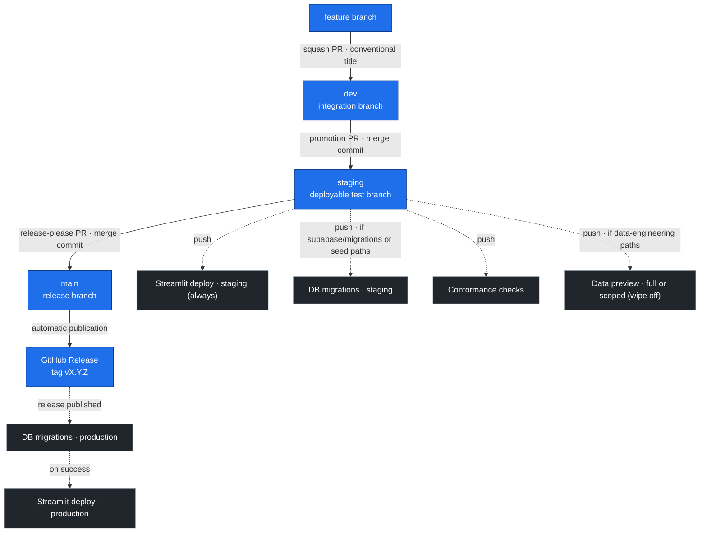

# Git Flow

Assistant RH uses three long-lived branches before production:

```text
feature branch -> dev -> staging -> release-please promotion PR -> main/tag -> production deploy
```



Solid arrows are branch promotions (merge policy on the label); dashed arrows are the CI/CD workflows each push triggers.

## Branch Roles

- `dev` is the integration branch for feature work. Feature PRs target `dev`.
- `staging` is the deployable test branch. Merging `dev` into `staging` deploys the staging app and runs staging data preview jobs.
- `main` is the release branch. The release-please PR is also the promotion of the validated `staging` revision into `main`.

Do not use `main` as the default target for feature work. Production deployment is gated by a published GitHub Release, not by an ordinary merge to `main`.

## Promotion Sequence

1. Create feature branches from up-to-date `dev`.
2. Open feature PRs against `dev`.
3. Squash feature PRs into `dev` with a conventional PR title, for example `feat: add trace filters` or `fix: harden staging deploy`.
4. After local validation on `dev`, open a promotion PR from `dev` to `staging`.
5. Merge `dev -> staging` with a merge commit, not squash.
6. Release Please automatically creates or updates one draft PR against `main`. Its head contains both `main` and the exact `staging` revision, followed by the version and changelog update.
7. The workflow waits for all push workflows attached to that staging SHA, refreshes `uv.lock` with a GitHub-signed commit, and leaves the PR in draft on any failure. It marks the PR ready only when staging is unchanged and green.
8. Review and merge that release/promotion PR with a merge commit, not squash.
9. The push to `main` publishes the tag and GitHub Release without opening another PR.
10. The published GitHub Release triggers production migrations and Streamlit production deployment.

Useful PR commands:

```bash
gh pr create -R DGAFP/assistant-rh --base dev --head <feature-branch>
gh pr create -R DGAFP/assistant-rh --base staging --head dev --title "chore: promote dev to staging"
```

## Merge Policy

Use squash merges for feature PRs into `dev`, and make the squash commit title conventional:

- `feat:` creates a minor release candidate.
- `fix:` creates a patch release candidate.
- `feat!:` or `BREAKING CHANGE:` creates a major release candidate.

Use merge commits for branch promotions:

- `dev -> staging`: preserve the conventional feature/fix commits that were tested locally.
- Release Please promotion -> `main`: preserve the candidate merge and the exact staging ancestry used to compute the version and release notes.

Do not open a separate `staging -> main` PR and do not squash the Release Please promotion PR. Squashing would discard the staging ancestry used by the next release candidate.

## Deployment Behavior

On push to `staging`:

- `.github/workflows/streamlit-deploy-staging.yml` deploys Streamlit to `scaleway-staging`.
- `.github/workflows/db-migrations-scaleway.yml` pushes Supabase migrations to the staging database when migration or seed paths changed.
- `.github/workflows/data-engineering-preview-staging.yml` builds selected staging job images and runs staging data preview jobs for changed data-engineering sources.
- `.github/workflows/release-please.yml` prepares the single draft release/promotion PR, refreshes its lockfile, and marks it ready after the staging workflows pass.

The automatic staging data preview runs selected medallion, ingestion, and embeddings jobs for changed Service-Public or Legifrance sources. It keeps `wipe_existing_chunks=false`. MATTE embeddings remain manual.

On push to `main`:

- `.github/workflows/release-please.yml` detects the merged pending release PR and publishes its tag and GitHub Release; it cannot open a second release PR.
- Production still deploys from the published release event, not directly from the branch push.

On release publication:

- `.github/workflows/db-migrations-scaleway.yml` pushes production migrations.
- `.github/workflows/streamlit-deploy-production.yml` deploys Streamlit production after the production migration workflow succeeds.

Production data ingestion/promotion remains manual through workflow dispatch.

## Release-Please

Release Please constructs `release-candidate` by merging the current `main` baseline with the protected `staging` revision. It reads the conventional commits from that combined history, updates `CHANGELOG.md`, bumps version fields, and opens one draft PR against `main`. The candidate and generated release branches are automation-owned and must not be edited manually.

The release PR remains a draft until `CI Tests`, `CodeQL`, `Conformance`, `Streamlit Deploy Staging`, and every other push workflow discovered for the same staging SHA have completed successfully. Its merge publishes a tag such as `v0.8.1` without a second PR.

Current release configuration:

- Workflow: `.github/workflows/release-please.yml`
- Config: `release-please-config.json`
- Manifest: `.release-please-manifest.json`
- Version files: root `pyproject.toml`, package `pyproject.toml` files, and `apps/mastra-pipeline/package.json`

Examples:

- A preserved `feat: add admin export` commit after the previous release creates a minor bump.
- A preserved `fix: repair staging health check` commit after the previous release creates a patch bump.
- A `chore:`-only promotion creates no release unless there are releasable commits since the previous release.

## Rollback and Manual Runs

For Streamlit production rollback, run **Streamlit Deploy Production** manually with `existing_image_tag` set to a known-good image tag, for example `release-v0.8.0`.

For staging or production data jobs, prefer workflow dispatch with explicit source and embedding options. Avoid destructive staging or production data operations unless the selected workflow inputs clearly request them and the target database has been confirmed.

## Repository Settings

Protect `dev`, `staging`, and `main` in GitHub:

- Require PRs before merging.
- Require status checks appropriate to each branch.
- Keep merge commits available for `staging` and `main` promotion PRs.
- Configure **Selected branches and tags** on both `scaleway-staging` and
  `scaleway-production`, with custom branch rules for `dev`, `staging`, and
  `main` only. Do not add a wildcard or tag rule.
- Keep deployment approval on `scaleway-production` in addition to that branch
  allowlist.

The environment branch policy is the security boundary for secret-backed
`workflow_dispatch` jobs: GitHub evaluates it before releasing environment
secrets. A branch check inside a workflow is insufficient because a manually
selected ref supplies its own workflow definition and can remove that check.

Verify the policy after any environment change:

```bash
gh api repos/DGAFP/assistant-rh/environments/scaleway-staging
gh api repos/DGAFP/assistant-rh/environments/scaleway-staging/deployment-branch-policies
gh api repos/DGAFP/assistant-rh/environments/scaleway-production
gh api repos/DGAFP/assistant-rh/environments/scaleway-production/deployment-branch-policies
```
